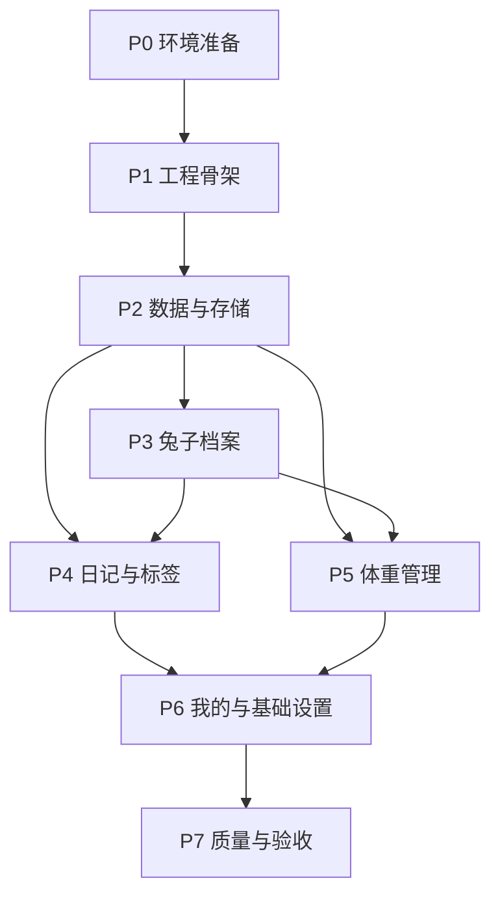

# Raby MVP 实施计划

> 状态:P0 环境已完成,P1 工程骨架已完成,P2 数据与存储已完成,P3 兔子档案已完成,P4 日记与标签已完成,P5 体重管理已完成,P6 我的与基础设置已完成,P7 自动化验收与 APK 构建已完成
>
> 日期:2026-06-08
>
> 更新:2026-06-10
>
> 关联文档:
> - [兔子档案 App 设计文档](./2026-05-29-rabbit-archive-design.md)
> - [Raby 兔子档案 App MVP PRD](./2026-06-08-raby-mvp-prd.md)
> - [Raby 移动端 UI/UX 设计规格](./2026-06-08-raby-ui-ux-spec.md)
> - [Raby 视觉风格规范](./2026-06-08-raby-visual-style-guide.md)
> - [Raby v0.1 数据模型详细设计](./2026-06-08-raby-v0.1-data-model.md)
> - [Raby v0.1 架构设计](./2026-06-09-raby-v0.1-architecture-design.md)
> - [Raby P4 日记与标签实施计划和架构设计](./2026-06-09-raby-p4-diary-tags-plan.md)
> - [Raby v0.1 关键交互流程设计](./2026-06-08-raby-v0.1-interaction-flows.md)
> - [Raby v0.1 开发环境配置记录](./2026-06-08-raby-v0.1-environment-setup.md)

---

## 1. 当前基线

截至 2026-06-10,项目目录里已有产品和设计文档,并已完成 Flutter Android 工程骨架、兔子档案、日记与标签、照片、体重管理、我的页和基础设置闭环。

本机环境检查结果:

- Flutter SDK:已安装到 `D:\work\toolchains\flutter`,版本 `3.44.1`
- Dart SDK:随 Flutter 提供,版本 `3.12.1`
- Android SDK:已配置到 `C:\Users\ruihuang13\AppData\Local\Android\Sdk`,平台 `android-36.1` / `android-36` / `android-35`,build-tools `36.1.0` / `36.0.0`
- JDK:Flutter 已配置使用 `C:\Program Files\Java\jdk-17`
- Android cmdline-tools:已安装到 Android SDK 的 `cmdline-tools\latest`
- Android NDK:已安装 `28.2.13676358`
- Android CMake:已安装 `3.22.1`
- Android licenses:已接受
- AVD:已有并可启动 `Medium_Phone_API_36.1`
- 项目环境脚本:见 `tooling/env.ps1`、`tooling/doctor.ps1`、`tooling/start-emulator.ps1`

P1 已生成并验证:

- Flutter Android 工程:含 `android/`、`lib/`、`pubspec.yaml`。
- App 入口:`ProviderScope` + `MaterialApp.router`。
- 基础路由:`/records`、`/weight`、`/me`。
- 基础主题:Raby Warm MD3。
- 基础 UI 页面:记录、体重、我的。
- Android debug APK:`D:\work\proj\raby\build\app\outputs\flutter-apk\app-debug.apk`。

因此 v0.1 代码层面已进入可验收状态。下一步是把 APK 安装到手机上,按 v0.1 验收脚本做真机手工确认。

---

## 2. 交付策略

MVP 按 3 个版本推进:

| 阶段 | 目标 | 交付判断 |
|---|---|---|
| v0.1 可记录内测版 | 建档、写日记、记体重、看基础趋势 | 能完成一只兔子的完整记录闭环 |
| v0.2 回看与备份版 | 热力图、大事记、提醒、导出 | 能长期回看和手动备份 |
| v1.0 完整 MVP 发布版 | 多兔、导入、迁移、发布质量 | 可小范围分发和长期自用 |

开发优先级以 v0.1 为第一目标。v0.1 不做视频、通知、导入导出、多兔完整切换和复杂分析。

---

## 3. v0.1 范围

### 3.1 必须包含

- Flutter Android 工程骨架
- Riverpod 状态管理
- go_router 路由
- Drift SQLite 数据库
- App 私有目录媒体存储
- 基础主题和 UI 组件
- 兔子档案新建、编辑、查看
- 日记新建、编辑、删除、时间轴列表
- 日记支持文字、最多 9 张照片、标签
- 体重记录新建、编辑、删除、历史列表
- 体重折线图,先支持全部数据视图
- 设置页基础入口
- 基础单元测试和 Widget 测试

### 3.2 v0.1 不做

- 短视频
- ZIP 导入导出
- 本地通知
- 多兔完整切换体验
- 记录热力图
- 兔生大事记
- 体重异常预警
- BCS 体况评分

---

## 4. 开发顺序

### P0. 环境准备

| 编号 | 任务 | 产出 | 验收 |
|---|---|---|---|
| P0-1 | 安装 Flutter SDK | 本机可运行 `flutter` | 已完成:`flutter --version` 正常输出 |
| P0-2 | 配置 Android 开发环境 | Android toolchain 可用 | 已完成:`flutter doctor` Android toolchain 通过 |
| P0-3 | 准备模拟器或真机 | 可启动 Android 调试 | 已完成:`flutter devices` 能看到 `emulator-5554` |

### P1. 工程骨架

| 编号 | 任务 | 产出 | 验收 |
|---|---|---|---|
| P1-1 | 创建 Flutter 项目 | `android/`、`lib/`、`pubspec.yaml` | 已完成:`assembleDebug` 生成 debug APK |
| P1-2 | 添加核心依赖 | Riverpod、go_router、Drift、fl_chart 等 | 已完成:`flutter pub get` 成功 |
| P1-3 | 建立目录结构 | `app/`、`core/`、`data/`、`domain/`、`features/`、`shared/` | 已完成:目录与设计文档一致 |
| P1-4 | 建立 App 入口 | `ProviderScope`、`MaterialApp.router`、主题 | 已完成:记录页可显示 |
| P1-5 | 建立基础路由 | 记录、体重、我的 | 已完成:Widget 测试覆盖底部导航切换 |

P1 当前有意暂缓图片选择插件。`image_picker` 在当前 Android/Kotlin 构建链上引入了未使用的额外编译负担,将在 P4 日记照片功能实现时重新评估并接入图片选择方案。

### P2. 数据与存储

| 编号 | 任务 | 产出 | 验收 |
|---|---|---|---|
| P2-1 | 定义数据库表 | rabbits、diaries、diary_media、tags、diary_tags、weight_records | 表含 UUID、createdAt、updatedAt、deletedAt |
| P2-2 | 建立 Drift 数据库 | `AppDatabase`、DAO、迁移版本 | App 启动可初始化数据库 |
| P2-3 | 建立 Domain 实体 | Rabbit、Diary、DiaryMedia、Tag、WeightRecord | Domain 层无 Flutter/Drift 依赖 |
| P2-4 | 建立 Repository 接口和实现 | Domain 接口 + Data 实现 | 基础 CRUD 可调用 |
| P2-5 | 建立媒体存储服务 | 图片复制到 App 私有目录 | 数据库只保存相对路径 |

### P3. 兔子档案

状态:已完成。已实现启动初始化、首次建档、首页读取默认兔兔、我的页档案入口、档案详情和编辑流程。

| 编号 | 任务 | 产出 | 验收 |
|---|---|---|---|
| P3-1 | 首次建档流程 | 无兔子时进入建档页 | 新用户能创建第一只兔子 |
| P3-2 | 档案表单 | 名字、性别、生日/领养日、品种、毛色、头像 | 必填校验准确 |
| P3-3 | 档案详情页 | 展示静态信息和头像 | 退出重进数据仍在 |
| P3-4 | 档案编辑 | 修改并保存字段 | 更新时间更新 |

### P4. 日记与标签

状态:代码层面已完成,待真机验收。

| 编号 | 任务 | 产出 | 验收 |
|---|---|---|---|
| P4-1 | 日记时间轴 | 倒序 Feed 列表 | 已完成:真实列表和空状态已接入 |
| P4-2 | 日记编辑页 | 正文、日期、照片、标签 | 已完成:正文或照片至少有一个 |
| P4-3 | 图片选择和保存 | 最多 9 张照片 | 已完成:图片复制到私有目录并可显示 |
| P4-4 | 标签基础能力 | 系统标签 + 自定义标签 | 已完成:日记可绑定多个标签 |
| P4-5 | 日记删除 | 软删除记录 | 已完成:时间轴不再显示被删日记 |
| P4-6 | 图片浏览 | 单图/多图预览 | 已完成:可从时间轴打开图片 |

### P5. 体重管理

状态:代码层面已完成,待真机验收。

| 编号 | 任务 | 产出 | 验收 |
|---|---|---|---|
| P5-1 | 体重首页 | 趋势图 + 历史列表 | 已完成:无数据、有数据状态都清晰 |
| P5-2 | 体重编辑页 | 日期、体重 g、备注 | 已完成:体重 1-20000g 且日期不可晚于今天 |
| P5-3 | 体重 CRUD | 新建、编辑、删除 | 已完成:修改后列表和图表同步刷新 |
| P5-4 | 折线图 | fl_chart 全部数据视图 | 已完成:全部数据折线图接入 |

### P6. 我的与基础设置

状态:代码层面已完成,待真机验收。

| 编号 | 任务 | 产出 | 验收 |
|---|---|---|---|
| P6-1 | 我的页 | 档案入口、设置入口 | 已完成:可进入档案详情和设置 |
| P6-2 | 设置页 | App 信息、关于入口 | 已完成:不展示备份、导入导出、通知等不可用入口 |
| P6-3 | 空状态和错误反馈 | 统一 Empty/Error UI | 已完成:关键空/错状态有明确下一步 |

### P7. 质量与验收

状态:自动化验收和 APK 构建已完成;真机手工验收待安装确认。

| 编号 | 任务 | 产出 | 验收 |
|---|---|---|---|
| P7-1 | 静态检查 | Analyze 无阻塞错误 | 已完成:`flutter analyze` 通过 |
| P7-2 | 单元测试 | 用例覆盖实体转换、DAO、Repository | 已完成:`flutter test` 通过 |
| P7-3 | Widget 测试 | 建档、日记、体重核心表单 | 已完成:关键表单和路由闭环通过 |
| P7-4 | 手工验收 | v0.1 验收脚本 | APK 已生成,待手机安装后确认 |

---

## 5. v0.1 任务依赖



---

## 6. v0.1 验收脚本

手工验收按以下流程执行:

1. 清空本地数据后启动 App。
2. App 进入首次建档流程。
3. 创建一只兔子,填写名字、性别、生日或领养日、品种、毛色。
4. 进入记录页,创建一条日记,包含文字、2 张照片和至少 1 个标签。
5. 返回时间轴,确认日记按时间倒序出现,照片缩略图可打开预览。
6. 编辑日记正文和日期,确认时间轴重新排序。
7. 删除日记,确认时间轴不再展示该记录。
8. 进入体重页,连续录入 10 条体重记录。
9. 确认体重列表和折线图展示正确。
10. 编辑其中一条体重记录,确认列表和图表同步更新。
11. 退出 App 后重新进入,确认档案、日记、照片、体重仍存在。

v0.1 通过标准:

- 上述流程全部完成,无崩溃
- 数据重启后不丢失
- 表单校验准确
- 图片能正常保存和预览
- 图表能正确表达体重趋势

---

## 7. 自动化验证命令

开发期间每个阶段至少跑:

```powershell
flutter pub get
dart run build_runner build --delete-conflicting-outputs
flutter analyze
flutter test
```

涉及 Android 调试时跑:

```powershell
flutter doctor
flutter devices
flutter run
.\android\gradlew.bat --no-daemon --console=plain --stacktrace --max-workers=2 assembleDebug
```

---

## 8. v0.2 任务预告

v0.1 完成后进入 v0.2,建议按以下顺序:

1. 体重图表时间范围:周、月、年、全部
2. 记录热力图
3. 里程碑标签和兔生大事记
4. 体重异常提示
5. BCS 体况评分
6. ZIP 数据导出
7. 体重提醒和那年今日
8. 短视频初版

v0.2 的关键验收是:用户有 30 天记录后,可以看到热力图、里程碑回看,并能导出数据包。

---

## 9. v1.0 任务预告

v1.0 补齐发布级能力:

1. 多兔管理和切换
2. ZIP 覆盖导入
3. ZIP 基础合并导入
4. 数据库迁移测试
5. 媒体缺失和导入失败处理
6. APK 发布配置
7. 核心集成测试

v1.0 的关键验收是:导出再导入到空 App 后,档案、日记、照片、标签、体重能恢复,多兔数据不串档。

---

## 10. 主要风险

| 风险 | 影响 | 处理 |
|---|---|---|
| Flutter 环境未安装 | 无法开工 | P0 优先解决 |
| Drift + 代码生成配置复杂 | 影响骨架搭建 | P1/P2 先搭最小可运行数据库 |
| 图片权限和 Android 版本差异 | 影响日记照片 | v0.1 只做相册选择和私有目录保存 |
| 日记 Feed 图片多导致卡顿 | 影响体验 | 列表使用缩略图和懒加载 |
| 体重图表数据少时不好看 | 影响理解 | 少于 4 条时展示摘要和列表,不强行画复杂图 |

---

## 11. Done 标准

每个功能完成时必须同时满足:

- 数据能落库并可重新读取
- 页面有空状态、加载状态和错误反馈
- 表单有必填校验和清晰错误文案
- 主要操作有返回路径
- 触控目标不小于 48dp
- `flutter analyze` 无阻塞错误
- 关键业务逻辑至少有单元测试

---

## 12. 实施记录

### 12.1 P5 体重管理

状态:已完成,待真机验收。

完成内容:

- 新增 `weightRecordsProvider`、`weightChartRecordsProvider`、`weightRecordProvider`。
- 新增 `WeightEditorController`,统一处理新建、编辑、删除、体重范围和未来日期校验。
- 新增 `/weight/new`、`/weight/:id/edit` 路由和 `WeightEditPage`。
- 替换体重页占位实现,完成摘要、趋势图、历史列表、空状态、编辑和删除确认。
- 首页“记录体重”和“查看体重”入口已接入真实路由。

验收结果:

- `flutter analyze` 通过。
- `flutter test` 通过,共 25 个测试。
- 新增 controller 单测覆盖体重新建、编辑、删除、非法体重和未来日期。
- 新增 widget 测试覆盖体重记录新建、编辑、删除闭环。

### 12.2 P6 我的与基础设置

状态:已完成,待真机验收。

完成内容:

- 新增 `/settings` 路由和设置页,包含 App 信息、版本、本地数据说明和关于 Raby。
- 我的页设置入口已接入真实设置页,档案读取失败时展示可重试错误状态。
- 新增共享 `RabyStateCard`,统一关键空状态和错误状态的视觉、文案和主操作。
- 日记空状态、体重空状态、记录页无档案、记录/体重读取失败、档案详情无档案/错误状态已接入共享状态卡。
- 设置页不展示备份、导入导出、通知提醒、云同步等 v0.1 未实现入口。

验收结果:

- `flutter analyze` 通过。
- `flutter test` 通过,共 26 个测试。
- 新增 widget 测试覆盖从“我的”进入设置页、返回“我的”、以及不可用入口不展示。

### 12.3 P7 质量与验收

状态:自动化验收和 APK 构建已完成;真机手工验收待安装确认。

完成内容:

- 已执行 `flutter analyze`,无静态分析问题。
- 已执行 `flutter test`,全量 26 个测试通过。
- 已执行 `flutter build apk --debug`,生成 Android debug APK。
- 已检查连接设备,当前未检测到 Android 真机或模拟器,因此手工验收需在手机安装后执行。

验收结果:

- Flutter SDK:`3.44.1`,Dart:`3.12.1`。
- APK 路径:`D:\work\proj\raby\build\app\outputs\flutter-apk\app-debug.apk`。
- APK 大小:`192244334` 字节。
- 自动化覆盖范围包括数据库索引、Repository 行为、兔兔建档、日记/照片/标签、体重 CRUD、设置页入口和核心路由返回。
- `flutter doctor` 本轮执行超过 120 秒未返回,未纳入阻塞项;P0 已完成环境验收,且本轮 analyze/test/build 均通过。
