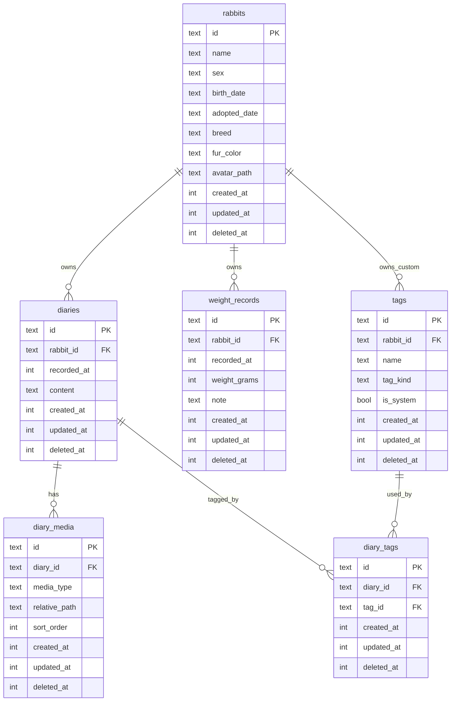

# Raby v0.1 数据模型详细设计

> 状态:初稿
>
> 日期:2026-06-08
>
> 适用版本:v0.1 可记录内测版
>
> 关联文档:
> - [兔子档案 App 设计文档](./2026-05-29-rabbit-archive-design.md)
> - [Raby MVP PRD](./2026-06-08-raby-mvp-prd.md)
> - [Raby MVP 实施计划](./2026-06-08-raby-mvp-implementation-plan.md)

---

## 1. 设计目标

v0.1 数据模型只服务一个最短闭环:

**创建兔子档案 -> 写日记和照片 -> 打标签 -> 记录体重 -> 看时间轴和体重趋势。**

同时必须为 v0.2/v1.0 预留:

- 多兔切换
- 里程碑聚合
- 数据导入导出
- 未来云同步
- 软删除恢复和冲突合并

---

## 2. 核心原则

### 2.1 ID 与同步预留

- 所有业务主表使用 UUID v4 字符串作为主键。
- 不使用自增 ID。
- 所有主表保留 `createdAt`、`updatedAt`、`deletedAt`。
- `deletedAt == null` 表示有效数据。
- 所有写操作必须更新 `updatedAt`。

### 2.2 时间存储

| 场景 | 存储方式 | 原因 |
|---|---|---|
| 创建/更新/删除时间 | UTC epoch milliseconds, `int` | 同步、排序、比较方便 |
| 日记记录时间 | UTC epoch milliseconds, `int` | 支持精确时间轴排序 |
| 体重记录时间 | UTC epoch milliseconds, `int` | 支持同一天多条记录 |
| 生日/领养日/绝育日/离世日 | `yyyy-MM-dd` 文本 | 日期本身无时区,避免跨时区偏移 |

### 2.3 媒体存储

- 媒体文件放 App 私有目录。
- 数据库只保存相对路径和元数据。
- v0.1 只使用图片,但 `mediaType` 预留 `video`。
- 日记媒体独立表存储,兔子头像先直接存头像相对路径。

### 2.4 删除策略

- v0.1 所有业务删除默认软删除。
- 软删除只设置 `deletedAt` 和 `updatedAt`。
- 媒体文件删除可以延后到清理任务,业务层不能继续引用被软删除记录。

---

## 3. ER 关系



---

## 4. 表结构

### 4.1 `rabbits`

兔子基础档案。v0.1 只展示默认兔子,但表结构支持多只兔子。

v0.1 表单只展示和写入:名字、性别、生日或领养日、品种、毛色、头像。其余字段是 v0.2+ 或档案详情增强预留字段,Domain 实体仍需保留这些字段,避免 Repository 更新时丢失已有数据。

| 字段 | 类型 | 必填 | 说明 |
|---|---|---:|---|
| `id` | text | 是 | UUID v4 |
| `name` | text | 是 | 1-20 个字符 |
| `sex` | text | 是 | `male` / `female` / `unknown` |
| `birth_date` | text | 否 | `yyyy-MM-dd`;生日 |
| `adopted_date` | text | 否 | `yyyy-MM-dd`;领养日 |
| `breed` | text | 是 | 品种,v0.1 先自由文本 |
| `fur_color` | text | 是 | 毛色,v0.1 先自由文本 |
| `avatar_path` | text | 否 | 头像相对路径 |
| `source` | text | 否 | 出生地/来源 |
| `neutered_status` | text | 否 | `not_neutered` / `neutered` / `unknown` |
| `neutered_date` | text | 否 | `yyyy-MM-dd` |
| `chip_number` | text | 否 | 芯片号 |
| `initial_weight_grams` | integer | 否 | 初始体重 |
| `personality_tags_json` | text | 否 | 性格标签 JSON 数组,v0.1 可不展示 |
| `favorite_foods` | text | 否 | 喜好食物 |
| `favorite_toys` | text | 否 | 喜好玩具 |
| `passed_away_date` | text | 否 | `yyyy-MM-dd`;离世日期 |
| `created_at` | integer | 是 | UTC epoch milliseconds |
| `updated_at` | integer | 是 | UTC epoch milliseconds |
| `deleted_at` | integer | 否 | 软删除时间 |

业务规则:

- `birth_date` 和 `adopted_date` 至少填一个,由 Domain 层校验。
- v0.1 首次启动时查询第一条未删除兔子作为默认兔子。
- 删除兔子在 v0.1 不建议做真实入口;如果做,必须二次确认并软删除。

索引:

- `idx_rabbits_deleted_at`
- `idx_rabbits_updated_at`

---

### 4.2 `diaries`

日记主表,只保存正文、记录时间和所属兔子。

| 字段 | 类型 | 必填 | 说明 |
|---|---|---:|---|
| `id` | text | 是 | UUID v4 |
| `rabbit_id` | text | 是 | 关联 `rabbits.id` |
| `recorded_at` | integer | 是 | 日记发生时间 |
| `content` | text | 否 | 日记正文 |
| `created_at` | integer | 是 | UTC epoch milliseconds |
| `updated_at` | integer | 是 | UTC epoch milliseconds |
| `deleted_at` | integer | 否 | 软删除时间 |

业务规则:

- 正文可以为空,但正文和媒体至少有一个。
- 时间轴按 `recorded_at desc, created_at desc` 排序。
- 删除日记时同步软删除 `diary_media` 和 `diary_tags` 关系。

索引:

- `idx_diaries_rabbit_recorded_at`: `rabbit_id`, `recorded_at`
- `idx_diaries_deleted_at`
- `idx_diaries_updated_at`

---

### 4.3 `diary_media`

日记媒体表。v0.1 只存图片,但为 v0.2 视频预留字段。

| 字段 | 类型 | 必填 | 说明 |
|---|---|---:|---|
| `id` | text | 是 | UUID v4 |
| `diary_id` | text | 是 | 关联 `diaries.id` |
| `media_type` | text | 是 | v0.1 固定 `image`;预留 `video` |
| `relative_path` | text | 是 | App 私有目录下相对路径 |
| `thumbnail_path` | text | 否 | 缩略图相对路径;v0.1 可为空 |
| `mime_type` | text | 否 | 如 `image/jpeg` |
| `width` | integer | 否 | 像素宽 |
| `height` | integer | 否 | 像素高 |
| `file_size_bytes` | integer | 否 | 文件大小 |
| `duration_ms` | integer | 否 | 视频时长;v0.1 为空 |
| `sort_order` | integer | 是 | 0-8,用于日记内排序 |
| `created_at` | integer | 是 | UTC epoch milliseconds |
| `updated_at` | integer | 是 | UTC epoch milliseconds |
| `deleted_at` | integer | 否 | 软删除时间 |

业务规则:

- 单条日记有效媒体最多 9 个。
- `sort_order` 从 0 开始连续排序。
- 媒体文件路径建议:
  - `media/diaries/{diaryId}/{mediaId}.jpg`
  - 缩略图: `media/diaries/{diaryId}/thumbs/{mediaId}.jpg`

索引:

- `idx_diary_media_diary_order`: `diary_id`, `sort_order`
- `idx_diary_media_deleted_at`
- `idx_diary_media_updated_at`

---

### 4.4 `tags`

标签表,统一支撑普通日记标签和里程碑标签。

| 字段 | 类型 | 必填 | 说明 |
|---|---|---:|---|
| `id` | text | 是 | UUID v4 |
| `rabbit_id` | text | 否 | 自定义标签所属兔子;系统标签为空 |
| `name` | text | 是 | 标签名 |
| `tag_kind` | text | 是 | `normal` / `milestone` |
| `is_system` | boolean | 是 | 是否系统预置 |
| `color_token` | text | 否 | UI token,如 `primary` / `secondary` |
| `icon_name` | text | 否 | 线性图标名;不存 emoji |
| `sort_order` | integer | 是 | 排序 |
| `created_at` | integer | 是 | UTC epoch milliseconds |
| `updated_at` | integer | 是 | UTC epoch milliseconds |
| `deleted_at` | integer | 否 | 软删除时间 |

业务规则:

- 系统标签 `rabbit_id = null`,所有兔子可用。
- 自定义标签 `rabbit_id` 指向兔子。
- 里程碑不是独立模块,通过 `tag_kind = milestone` 表达。
- v0.1 可以预置少量标签:晒太阳、吃草、剪指甲、看兽医、里程碑。

索引:

- `idx_tags_rabbit_id`: `rabbit_id`
- `idx_tags_kind`: `tag_kind`
- `idx_tags_deleted_at`
- `idx_tags_updated_at`

唯一性:

- 系统标签名不应重复。
- 同一兔子的自定义标签名不应重复。
- 由于 SQLite 对 `null` unique 行为特殊,唯一性建议先在 Repository/UseCase 层校验。

---

### 4.5 `diary_tags`

日记和标签的多对多关系表。

| 字段 | 类型 | 必填 | 说明 |
|---|---|---:|---|
| `id` | text | 是 | UUID v4 |
| `diary_id` | text | 是 | 关联 `diaries.id` |
| `tag_id` | text | 是 | 关联 `tags.id` |
| `created_at` | integer | 是 | UTC epoch milliseconds |
| `updated_at` | integer | 是 | UTC epoch milliseconds |
| `deleted_at` | integer | 否 | 软删除时间 |

业务规则:

- 同一条日记不能重复绑定同一个有效标签。
- 删除日记时同步软删除对应关系。
- 删除标签时不硬删历史关系,只让 UI 不再展示被删标签。

索引:

- `idx_diary_tags_diary_id`: `diary_id`
- `idx_diary_tags_tag_id`: `tag_id`
- `idx_diary_tags_deleted_at`
- `idx_diary_tags_updated_at`

唯一性:

- 有效关系应满足 `(diary_id, tag_id)` 不重复,由 UseCase 层校验。

---

### 4.6 `weight_records`

体重记录表。v0.1 不做 BCS 和照片,但字段可以先预留为可空。

| 字段 | 类型 | 必填 | 说明 |
|---|---|---:|---|
| `id` | text | 是 | UUID v4 |
| `rabbit_id` | text | 是 | 关联 `rabbits.id` |
| `recorded_at` | integer | 是 | 记录时间 |
| `weight_grams` | integer | 是 | 体重,单位 g |
| `note` | text | 否 | 备注 |
| `photo_path` | text | 否 | 体重照片相对路径;v0.1 可不使用 |
| `bcs_score` | integer | 否 | 1-5;v0.2 使用 |
| `created_at` | integer | 是 | UTC epoch milliseconds |
| `updated_at` | integer | 是 | UTC epoch milliseconds |
| `deleted_at` | integer | 否 | 软删除时间 |

业务规则:

- `weight_grams > 0`。
- 同一天允许多条记录,不做唯一约束。
- 列表和图表按 `recorded_at asc/desc` 聚合。
- v0.1 图表少于 4 条数据时,UI 可以弱化图表展示。

索引:

- `idx_weight_records_rabbit_recorded_at`: `rabbit_id`, `recorded_at`
- `idx_weight_records_deleted_at`
- `idx_weight_records_updated_at`

---

## 5. Drift 表定义草案

实际代码可以按以下文件拆分:

```text
lib/data/database/
├── app_database.dart
├── tables/
│   ├── rabbits.dart
│   ├── diaries.dart
│   ├── diary_media.dart
│   ├── tags.dart
│   ├── diary_tags.dart
│   └── weight_records.dart
└── daos/
    ├── rabbit_dao.dart
    ├── diary_dao.dart
    ├── tag_dao.dart
    └── weight_dao.dart
```

示例:

```dart
class Rabbits extends Table {
  TextColumn get id => text()();
  TextColumn get name => text()();
  TextColumn get sex => text()();
  TextColumn get birthDate => text().nullable()();
  TextColumn get adoptedDate => text().nullable()();
  TextColumn get breed => text()();
  TextColumn get furColor => text()();
  TextColumn get avatarPath => text().nullable()();
  TextColumn get source => text().nullable()();
  TextColumn get neuteredStatus => text().nullable()();
  TextColumn get neuteredDate => text().nullable()();
  TextColumn get chipNumber => text().nullable()();
  IntColumn get initialWeightGrams => integer().nullable()();
  TextColumn get personalityTagsJson => text().nullable()();
  TextColumn get favoriteFoods => text().nullable()();
  TextColumn get favoriteToys => text().nullable()();
  TextColumn get passedAwayDate => text().nullable()();
  IntColumn get createdAt => integer()();
  IntColumn get updatedAt => integer()();
  IntColumn get deletedAt => integer().nullable()();

  @override
  Set<Column> get primaryKey => {id};
}
```

```dart
class Diaries extends Table {
  TextColumn get id => text()();
  TextColumn get rabbitId => text().references(Rabbits, #id)();
  IntColumn get recordedAt => integer()();
  TextColumn get content => text().nullable()();
  IntColumn get createdAt => integer()();
  IntColumn get updatedAt => integer()();
  IntColumn get deletedAt => integer().nullable()();

  @override
  Set<Column> get primaryKey => {id};
}
```

```dart
class DiaryMedia extends Table {
  TextColumn get id => text()();
  TextColumn get diaryId => text().references(Diaries, #id)();
  TextColumn get mediaType => text()();
  TextColumn get relativePath => text()();
  TextColumn get thumbnailPath => text().nullable()();
  TextColumn get mimeType => text().nullable()();
  IntColumn get width => integer().nullable()();
  IntColumn get height => integer().nullable()();
  IntColumn get fileSizeBytes => integer().nullable()();
  IntColumn get durationMs => integer().nullable()();
  IntColumn get sortOrder => integer()();
  IntColumn get createdAt => integer()();
  IntColumn get updatedAt => integer()();
  IntColumn get deletedAt => integer().nullable()();

  @override
  Set<Column> get primaryKey => {id};
}
```

```dart
class Tags extends Table {
  TextColumn get id => text()();
  TextColumn get rabbitId => text().nullable().references(Rabbits, #id)();
  TextColumn get name => text()();
  TextColumn get tagKind => text()();
  BoolColumn get isSystem => boolean().withDefault(const Constant(false))();
  TextColumn get colorToken => text().nullable()();
  TextColumn get iconName => text().nullable()();
  IntColumn get sortOrder => integer().withDefault(const Constant(0))();
  IntColumn get createdAt => integer()();
  IntColumn get updatedAt => integer()();
  IntColumn get deletedAt => integer().nullable()();

  @override
  Set<Column> get primaryKey => {id};
}
```

```dart
class DiaryTags extends Table {
  TextColumn get id => text()();
  TextColumn get diaryId => text().references(Diaries, #id)();
  TextColumn get tagId => text().references(Tags, #id)();
  IntColumn get createdAt => integer()();
  IntColumn get updatedAt => integer()();
  IntColumn get deletedAt => integer().nullable()();

  @override
  Set<Column> get primaryKey => {id};
}
```

```dart
class WeightRecords extends Table {
  TextColumn get id => text()();
  TextColumn get rabbitId => text().references(Rabbits, #id)();
  IntColumn get recordedAt => integer()();
  IntColumn get weightGrams => integer()();
  TextColumn get note => text().nullable()();
  TextColumn get photoPath => text().nullable()();
  IntColumn get bcsScore => integer().nullable()();
  IntColumn get createdAt => integer()();
  IntColumn get updatedAt => integer()();
  IntColumn get deletedAt => integer().nullable()();

  @override
  Set<Column> get primaryKey => {id};
}
```

### 5.1 索引实现草案

索引不能只停留在说明里。v0.1 建库时必须创建以下索引,可以通过 Drift `@TableIndex` 或 `MigrationStrategy.onCreate` 的 `customStatement` 实现。若使用自定义 SQL,建议在 `m.createAll()` 后执行:

```dart
@override
MigrationStrategy get migration => MigrationStrategy(
  onCreate: (m) async {
    await m.createAll();
    await customStatement(
      'CREATE INDEX idx_rabbits_deleted_at ON rabbits(deleted_at);',
    );
    await customStatement(
      'CREATE INDEX idx_rabbits_updated_at ON rabbits(updated_at);',
    );
    await customStatement(
      'CREATE INDEX idx_diaries_rabbit_recorded_at ON diaries(rabbit_id, recorded_at);',
    );
    await customStatement(
      'CREATE INDEX idx_diaries_deleted_at ON diaries(deleted_at);',
    );
    await customStatement(
      'CREATE INDEX idx_diaries_updated_at ON diaries(updated_at);',
    );
    await customStatement(
      'CREATE INDEX idx_diary_media_diary_order ON diary_media(diary_id, sort_order);',
    );
    await customStatement(
      'CREATE INDEX idx_diary_media_deleted_at ON diary_media(deleted_at);',
    );
    await customStatement(
      'CREATE INDEX idx_diary_media_updated_at ON diary_media(updated_at);',
    );
    await customStatement(
      'CREATE INDEX idx_tags_rabbit_id ON tags(rabbit_id);',
    );
    await customStatement(
      'CREATE INDEX idx_tags_kind ON tags(tag_kind);',
    );
    await customStatement(
      'CREATE INDEX idx_tags_deleted_at ON tags(deleted_at);',
    );
    await customStatement(
      'CREATE INDEX idx_tags_updated_at ON tags(updated_at);',
    );
    await customStatement(
      'CREATE INDEX idx_diary_tags_diary_id ON diary_tags(diary_id);',
    );
    await customStatement(
      'CREATE INDEX idx_diary_tags_tag_id ON diary_tags(tag_id);',
    );
    await customStatement(
      'CREATE INDEX idx_diary_tags_deleted_at ON diary_tags(deleted_at);',
    );
    await customStatement(
      'CREATE INDEX idx_diary_tags_updated_at ON diary_tags(updated_at);',
    );
    await customStatement(
      'CREATE INDEX idx_weight_records_rabbit_recorded_at ON weight_records(rabbit_id, recorded_at);',
    );
    await customStatement(
      'CREATE INDEX idx_weight_records_deleted_at ON weight_records(deleted_at);',
    );
    await customStatement(
      'CREATE INDEX idx_weight_records_updated_at ON weight_records(updated_at);',
    );
  },
);
```

测试要求:

- DAO 测试需要覆盖时间轴和体重列表排序。
- 数据库初始化测试需要确认上述索引存在,避免后续直接按表草案实现时漏掉。

---

## 6. Domain 实体

Domain 层实体不暴露 Drift 类型,建议使用 freezed。

### 6.1 `Rabbit`

```dart
class Rabbit {
  final String id;
  final String name;
  final RabbitSex sex;
  final String? birthDate;
  final String? adoptedDate;
  final String breed;
  final String furColor;
  final String? avatarPath;
  final String? source;
  final NeuteredStatus? neuteredStatus;
  final String? neuteredDate;
  final String? chipNumber;
  final int? initialWeightGrams;
  final List<String> personalityTags;
  final String? favoriteFoods;
  final String? favoriteToys;
  final String? passedAwayDate;
  final DateTime createdAt;
  final DateTime updatedAt;
  final DateTime? deletedAt;
}
```

v0.1 UI 只使用基础字段,但 Repository 映射必须保留完整字段。编辑档案时若某些字段未出现在表单中,不得把它们覆盖成 `null`。

### 6.2 `Diary`

```dart
class Diary {
  final String id;
  final String rabbitId;
  final DateTime recordedAt;
  final String? content;
  final DateTime createdAt;
  final DateTime updatedAt;
  final DateTime? deletedAt;
}
```

### 6.3 `DiaryMedia`

```dart
class DiaryMedia {
  final String id;
  final String diaryId;
  final MediaType mediaType;
  final String relativePath;
  final String? thumbnailPath;
  final int sortOrder;
  final int? width;
  final int? height;
  final int? fileSizeBytes;
}
```

### 6.4 `Tag`

```dart
class Tag {
  final String id;
  final String? rabbitId;
  final String name;
  final TagKind tagKind;
  final bool isSystem;
  final String? colorToken;
  final String? iconName;
  final int sortOrder;
}
```

### 6.5 `DiaryEntry`

UI 层常用聚合实体:

```dart
class DiaryEntry {
  final Diary diary;
  final List<DiaryMedia> media;
  final List<Tag> tags;
}
```

### 6.6 `WeightRecord`

```dart
class WeightRecord {
  final String id;
  final String rabbitId;
  final DateTime recordedAt;
  final int weightGrams;
  final String? note;
  final String? photoPath;
  final int? bcsScore;
}
```

---

## 7. 枚举值

| 枚举 | 值 |
|---|---|
| `RabbitSex` | `male`, `female`, `unknown` |
| `NeuteredStatus` | `not_neutered`, `neutered`, `unknown` |
| `MediaType` | `image`, `video` |
| `TagKind` | `normal`, `milestone` |

枚举落库使用字符串,不要使用 int ordinal,避免后续插入新值导致兼容问题。

---

## 8. Repository 接口

### 8.1 `RabbitRepository`

```dart
abstract interface class RabbitRepository {
  Stream<List<Rabbit>> watchActiveRabbits();
  Stream<Rabbit?> watchDefaultRabbit();
  Future<Rabbit?> getDefaultRabbit();
  Future<void> createRabbit(Rabbit rabbit);
  Future<void> updateRabbit(Rabbit rabbit);
  Future<void> softDeleteRabbit(String id);
}
```

### 8.2 `DiaryRepository`

```dart
abstract interface class DiaryRepository {
  Stream<List<DiaryEntry>> watchTimeline(String rabbitId);
  Future<DiaryEntry?> getDiaryEntry(String id);
  Future<void> createDiary({
    required Diary diary,
    required List<DiaryMedia> media,
    required List<String> tagIds,
  });
  Future<void> updateDiary({
    required Diary diary,
    required List<DiaryMedia> media,
    required List<String> tagIds,
  });
  Future<void> softDeleteDiary(String id);
}
```

### 8.3 `TagRepository`

```dart
abstract interface class TagRepository {
  Stream<List<Tag>> watchAvailableTags(String rabbitId);
  Future<List<Tag>> getAvailableTags(String rabbitId);
  Future<void> ensureSystemTagsSeeded();
  Future<Tag> createCustomTag({
    required String rabbitId,
    required String name,
    TagKind tagKind = TagKind.normal,
  });
  Future<void> softDeleteTag(String id);
}
```

### 8.4 `WeightRepository`

```dart
abstract interface class WeightRepository {
  Stream<List<WeightRecord>> watchRecords(String rabbitId);
  Future<void> createRecord(WeightRecord record);
  Future<void> updateRecord(WeightRecord record);
  Future<void> softDeleteRecord(String id);
}
```

---

## 9. DAO 查询要求

### 9.1 默认兔子

查询:

- `deleted_at is null`
- `order by created_at asc`
- `limit 1`

v1.0 多兔切换时再引入当前兔子偏好设置。

### 9.2 日记时间轴

查询:

- `diaries.rabbit_id = currentRabbitId`
- `diaries.deleted_at is null`
- 关联未删除 `diary_media`
- 关联未删除 `diary_tags` 和未删除 `tags`
- `order by diaries.recorded_at desc, diaries.created_at desc`

DAO 可以返回数据层聚合对象,Repository 再映射为 Domain `DiaryEntry`。

### 9.3 可用标签

查询:

- 系统标签:`is_system = true and deleted_at is null`
- 自定义标签:`rabbit_id = currentRabbitId and deleted_at is null`
- 排序:`tag_kind desc, sort_order asc, name asc`

### 9.4 体重记录

查询:

- `rabbit_id = currentRabbitId`
- `deleted_at is null`
- 图表:`order by recorded_at asc`
- 列表:`order by recorded_at desc`

---

## 10. 媒体目录规范

App 私有目录下建议结构:

```text
app_documents/
├── raby.db
└── media/
    ├── rabbits/
    │   └── {rabbitId}/
    │       └── avatar/
    │           └── {mediaId}.jpg
    └── diaries/
        └── {diaryId}/
            ├── {mediaId}.jpg
            └── thumbs/
                └── {mediaId}.jpg
```

路径入库时只保存相对路径,例如:

```text
media/diaries/{diaryId}/{mediaId}.jpg
```

规则:

- 业务层不保存绝对路径。
- 导出 ZIP 时保留 `media/` 相对结构。
- 图片复制成功后再提交数据库事务。
- 如果数据库提交失败,应尝试清理已复制的临时文件。

---

## 11. 事务边界

以下操作必须使用事务:

| 操作 | 事务内容 |
|---|---|
| 创建日记 | 插入 `diaries`、插入 `diary_media`、插入 `diary_tags` |
| 更新日记 | 更新 `diaries`、软删除旧媒体关系或重排、更新标签关系 |
| 删除日记 | 软删除 `diaries`、`diary_media`、`diary_tags` |
| 创建兔子 | 插入 `rabbits`、必要时 seed 默认标签 |
| 删除兔子 | 软删除兔子及其日记、媒体、标签关系、体重记录 |

媒体文件复制本身不属于 SQLite 事务,需要在 UseCase 层做补偿清理。

---

## 12. 数据校验

### 12.1 Rabbit

- `name.trim().isNotEmpty`
- `name.length <= 20`
- `sex` 必须是枚举值
- `birthDate != null || adoptedDate != null`
- `breed.trim().isNotEmpty`
- `furColor.trim().isNotEmpty`
- `initialWeightGrams == null || initialWeightGrams > 0`

### 12.2 Diary

- `content` 和 `media` 至少有一个有效值
- `media.length <= 9`
- `recordedAt` 必填
- `tagIds` 去重

### 12.3 Tag

- `name.trim().isNotEmpty`
- `name.length <= 12`
- 同一作用域内标签名不重复
- `tagKind` 必须是枚举值

### 12.4 WeightRecord

- `weightGrams > 0`
- `weightGrams <= 20000`
- `bcsScore == null || bcsScore between 1 and 5`
- `recordedAt` 必填

---

## 13. 初始化数据

v0.1 首次启动时需要:

1. 初始化数据库 schema version 1。
2. 如果系统标签不存在,写入默认系统标签。
3. 如果没有兔子档案,路由进入首次建档页。

默认系统标签建议:

| 标签 | `tagKind` | `colorToken` |
|---|---|---|
| 日常 | `normal` | `primary` |
| 晒太阳 | `normal` | `primary` |
| 吃草 | `normal` | `primary` |
| 剪指甲 | `normal` | `secondary` |
| 看兽医 | `normal` | `warning` |
| 里程碑 | `milestone` | `secondary` |

---

## 14. Schema 版本

v0.1:

```dart
@DriftDatabase(
  tables: [
    Rabbits,
    Diaries,
    DiaryMedia,
    Tags,
    DiaryTags,
    WeightRecords,
  ],
  daos: [
    RabbitDao,
    DiaryDao,
    TagDao,
    WeightDao,
  ],
)
class AppDatabase extends _$AppDatabase {
  @override
  int get schemaVersion => 1;
}
```

迁移原则:

- 从 v0.1 开始只增量迁移,不做破坏性重建。
- 新字段优先 nullable 或带默认值。
- 枚举只追加新值,不改旧值语义。
- 导入导出协议应记录 schema version。

---

## 15. v0.1 测试清单

### 15.1 DAO 测试

- [ ] 创建兔子后可查询默认兔子。
- [ ] 软删除兔子后默认查询不返回。
- [ ] 创建日记后时间轴按 `recordedAt desc` 返回。
- [ ] 日记媒体按 `sortOrder asc` 返回。
- [ ] 日记标签能正确聚合。
- [ ] 软删除日记后时间轴不返回。
- [ ] 创建体重记录后图表查询按 `recordedAt asc` 返回。
- [ ] 体重记录同一天多条可共存。

### 15.2 Repository 测试

- [ ] Domain 实体和 Drift row 双向映射正确。
- [ ] 创建日记时正文和媒体至少一个。
- [ ] 创建日记时超过 9 张图片会失败。
- [ ] 重复标签会自动去重或报业务错误。
- [ ] 创建体重时 `weightGrams <= 0` 会失败。

### 15.3 媒体存储测试

- [ ] 图片能复制到 `media/diaries/{diaryId}/`。
- [ ] 入库路径为相对路径。
- [ ] 删除日记后 UI 不再引用媒体。

---

## 16. v0.2/v1.0 扩展点

| 未来能力 | 当前预留 |
|---|---|
| 短视频 | `diary_media.media_type`, `duration_ms`, `thumbnail_path` |
| 里程碑大事记 | `tags.tag_kind = milestone` |
| 多兔切换 | 所有记录都有 `rabbit_id` |
| 导出导入 | UUID、相对媒体路径、schema version |
| 数据合并 | `updated_at`、`deleted_at` |
| 体况评分 | `weight_records.bcs_score` |
| 体重照片 | `weight_records.photo_path` |
| 云同步 | Domain Repository 抽象 + UUID + 软删除 |
