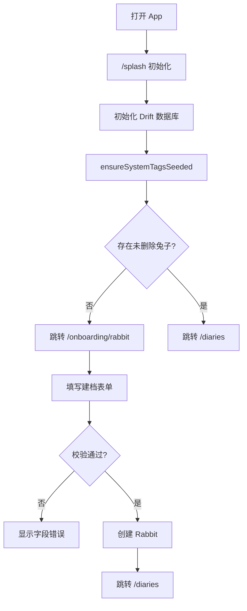
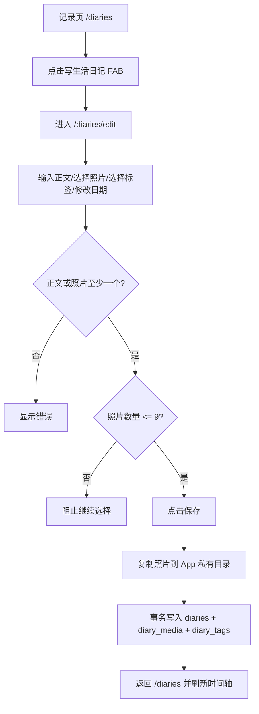
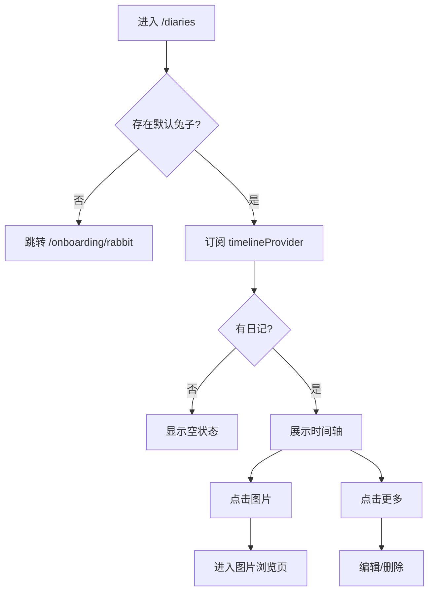
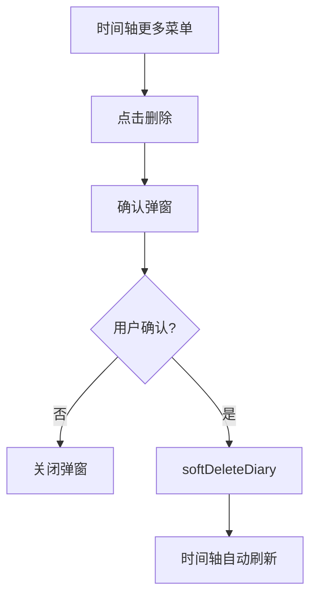
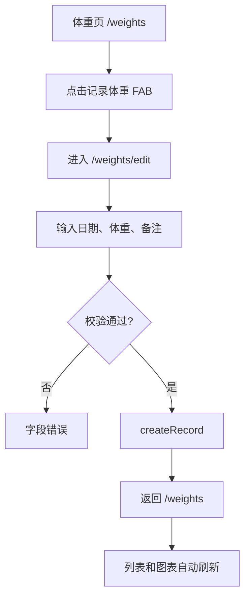
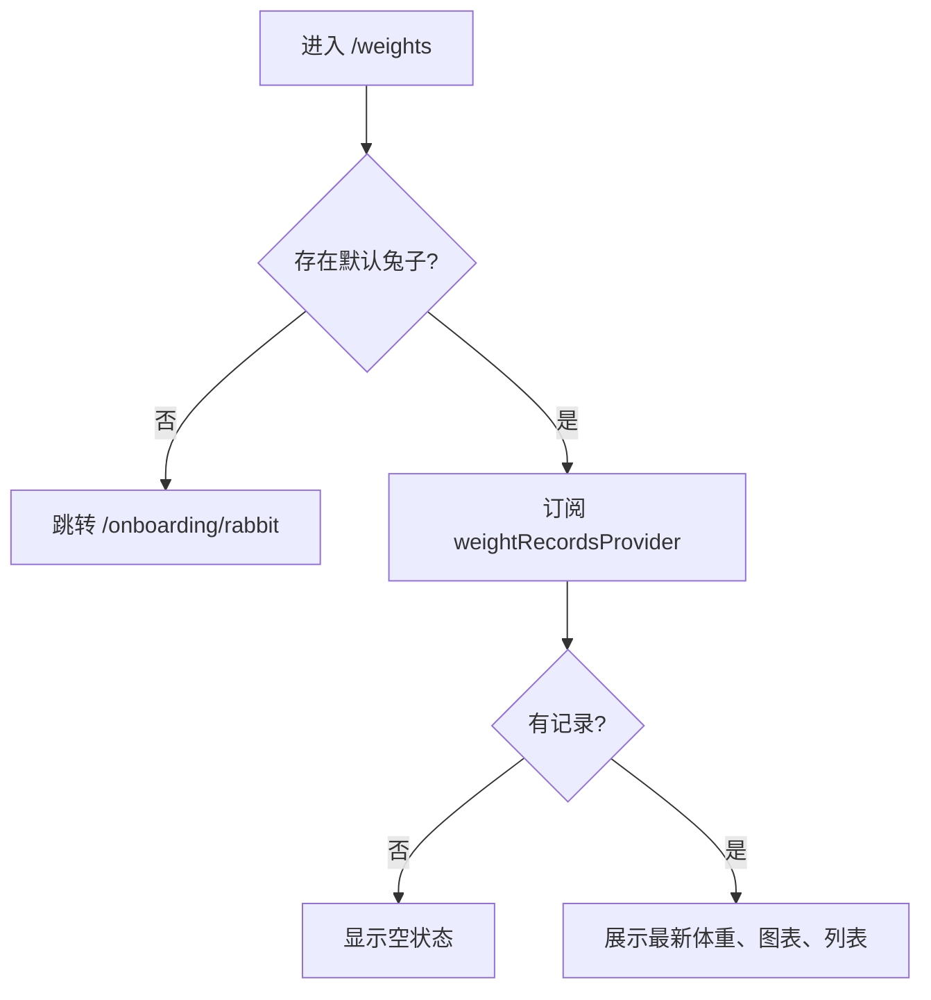

# Raby v0.1 关键交互流程设计

> 状态:初稿
>
> 日期:2026-06-08
>
> 适用版本:v0.1 可记录内测版
>
> 关联文档:
> - [Raby MVP PRD](./2026-06-08-raby-mvp-prd.md)
> - [Raby MVP 实施计划](./2026-06-08-raby-mvp-implementation-plan.md)
> - [Raby 移动端 UI/UX 设计规格](./2026-06-08-raby-ui-ux-spec.md)
> - [Raby v0.1 数据模型详细设计](./2026-06-08-raby-v0.1-data-model.md)

---

## 1. 目标

本文件定义 v0.1 的关键交互流程,确保页面、路由、状态管理、数据写入和错误处理可以按同一套规则实现。

v0.1 的核心闭环:

1. 首次启动并创建兔子档案
2. 写一条带照片和标签的日记
3. 在时间轴查看、编辑、删除日记
4. 记录体重并刷新列表和图表
5. 查看图片
6. 处理空状态、失败状态和返回路径

---

## 2. 全局流程约定

### 2.1 路由

| 页面 | 路由 | 说明 |
|---|---|---|
| 启动页 | `/splash` | 初始化数据库和系统标签 |
| 首次建档页 | `/onboarding/rabbit` | 没有兔子档案时进入 |
| 记录页 | `/diaries` | v0.1 默认首页 |
| 日记编辑页 | `/diaries/edit/:id?` | `id` 为空表示新建 |
| 图片浏览页 | `/media/photos` | 从日记卡片打开 |
| 体重页 | `/weights` | 体重图表和记录列表 |
| 体重编辑页 | `/weights/edit/:id?` | `id` 为空表示新建 |
| 我的页 | `/me` | 档案和设置入口 |
| 档案详情页 | `/me/rabbit` | 当前兔子档案 |
| 档案编辑页 | `/me/rabbit/edit` | 编辑当前兔子 |
| 设置页 | `/settings` | 基础设置 |

### 2.2 全局状态

v0.1 建议维护以下全局 Provider:

| 状态 | 含义 |
|---|---|
| `appBootstrapProvider` | 数据库初始化、系统标签初始化、默认兔子判断 |
| `defaultRabbitProvider` | 当前默认兔子 |
| `timelineProvider(rabbitId)` | 当前兔子日记时间轴 |
| `availableTagsProvider(rabbitId)` | 系统标签 + 当前兔子自定义标签 |
| `weightRecordsProvider(rabbitId)` | 当前兔子体重记录 |

### 2.3 通用 UI 状态

所有页面必须区分:

- Loading:首次加载或提交中
- Empty:数据为空
- Error:加载失败或保存失败
- Ready:可操作状态

### 2.4 异步操作规则

- 保存、删除、图片复制等操作必须禁用重复点击。
- 成功后使用轻量 Snackbar。
- 失败时优先显示字段级错误;无法定位字段时显示页面级错误。
- 不在用户未确认时执行危险删除。

---

## 3. 首次启动与建档

### 3.1 流程图



### 3.2 页面行为

启动页:

- 展示品牌或轻量 loading。
- 不展示跳过按钮。
- 初始化失败时显示错误和“重试”。

首次建档页:

- 必填:名字、性别、生日或领养日、品种、毛色。
- 可选:头像。
- 主按钮:完成建档。

### 3.3 数据动作

启动:

1. 打开数据库。
2. 运行 schema version 1。
3. 调用 `TagRepository.ensureSystemTagsSeeded()`。
4. 调用 `RabbitRepository.getDefaultRabbit()`。

建档:

1. 表单校验。
2. 如果选择头像,先复制头像到 `media/rabbits/{rabbitId}/avatar/{mediaId}.jpg`。
3. 创建 `Rabbit`。
4. 写入 `rabbits` 表。
5. 刷新 `defaultRabbitProvider`。

### 3.4 失败处理

| 失败 | 处理 |
|---|---|
| 数据库初始化失败 | `/splash` 显示错误和重试 |
| 系统标签初始化失败 | 允许重试,不进入主页面 |
| 必填字段缺失 | 字段下方显示错误 |
| 头像复制失败 | 保留表单,提示“头像保存失败,可稍后再试” |
| 创建兔子失败 | 页面级错误,保留输入内容 |

---

## 4. 写日记与照片保存

### 4.1 流程图



### 4.2 页面行为

日记编辑页:

- AppBar 左侧:取消。
- AppBar 右侧:保存。
- 正文输入在首屏主要区域。
- 图片选择区显示已选照片和添加按钮。
- 日期默认当前时间,可修改。
- 标签使用 Chip 多选。

### 4.3 数据动作

保存新日记:

1. 生成 `diaryId`。
2. 生成每个 `mediaId`。
3. 将临时选中的图片复制到:
   - `media/diaries/{diaryId}/{mediaId}.jpg`
4. 构造 `Diary`。
5. 构造 `DiaryMedia` 列表。
6. 去重 `tagIds`。
7. 调用 `DiaryRepository.createDiary(...)`。
8. Repository 内部使用事务写入:
   - `diaries`
   - `diary_media`
   - `diary_tags`

### 4.4 保存按钮状态

| 状态 | 行为 |
|---|---|
| 表单无内容 | 保存按钮 disabled;正文为空且照片为空时不可提交 |
| 正在保存 | 保存按钮 disabled + loading |
| 保存成功 | Snackbar:已保存 |
| 保存失败 | 保留当前编辑内容 |

补充规则:

- 用户把正文和照片都清空后,保存按钮立即变为 disabled。
- 保存按钮 disabled 时,正文输入区下方显示轻提示:至少写点文字或添加一张照片。

### 4.5 失败处理

| 失败 | 处理 |
|---|---|
| 图片超过 9 张 | 选择器返回后截断或提示,建议直接阻止 |
| 图片复制失败 | 停止保存,提示“照片保存失败” |
| 数据库写入失败 | 尝试删除已复制图片,保留编辑内容 |
| 标签不存在 | 忽略无效 tagId 并记录日志;若全部无效仍可保存 |
| 无默认兔子 | 返回建档流程 |

---

## 5. 日记时间轴

### 5.1 流程图



### 5.2 页面行为

时间轴:

- 默认按 `recordedAt desc, createdAt desc`。
- 日记卡片显示日期、标签、正文、图片网格。
- 正文超过 3 行折叠。
- 编辑和删除放在更多菜单。

空状态:

- 文案:还没有生活记录。
- 主按钮:写第一条日记。
- 可使用线稿兔子插画。

### 5.3 数据动作

进入页面:

1. 获取默认兔子。
2. 订阅 `DiaryRepository.watchTimeline(rabbitId)`。
3. 聚合 `DiaryEntry`。

刷新:

- Drift Stream 自动刷新。
- v0.1 不需要手动下拉刷新,可选。

---

## 6. 编辑和删除日记

### 6.1 编辑日记

流程:

1. 时间轴卡片点击更多。
2. 选择“编辑”。
3. 进入 `/diaries/edit/{id}`。
4. 加载 `DiaryEntry`。
5. 用户修改正文、日期、图片、标签。
6. 点击保存。
7. 事务更新日记、媒体和标签关系。
8. 返回时间轴。

数据处理:

- 已存在媒体保留原 `id` 和 `relativePath`。
- 新增照片复制到日记目录。
- 删除照片将对应 `diary_media.deletedAt` 设置为当前时间。
- 重新排序更新 `sortOrder`。
- 标签关系按最终选择集合重建或软删除差异项。

失败处理:

| 失败 | 处理 |
|---|---|
| 日记不存在或已删除 | 返回时间轴并提示“记录不存在” |
| 新照片复制失败 | 保留编辑内容并提示 |
| 更新事务失败 | 保留编辑内容并提示 |

### 6.2 删除日记

流程:



弹窗:

- 标题:删除这条记录?
- 正文:删除后不会在时间轴显示。
- 操作:取消、删除。

数据动作:

- 设置 `diaries.deletedAt`。
- 设置该日记下 `diary_media.deletedAt`。
- 设置该日记下 `diary_tags.deletedAt`。
- 暂不物理删除文件。

---

## 7. 图片浏览

### 7.1 流程

1. 用户点击日记卡片中的图片。
2. 进入 `/media/photos`。
3. 通过 go_router `extra` 传入图片列表和初始 index。
4. 展示全屏图片浏览。
5. 用户返回到时间轴。

### 7.2 页面行为

- 黑色或深色背景。
- 顶部返回按钮。
- 底部显示 `当前序号 / 总数`。
- 支持滑动切换和双指缩放。

### 7.3 路由参数

图片浏览页不通过 query 参数传图片路径列表,避免 URL 过长和路径转义问题。建议通过 `go_router` 的 `extra` 传递:

```dart
class PhotoViewerArgs {
  const PhotoViewerArgs({
    required this.photos,
    required this.initialIndex,
  });

  final List<DiaryMedia> photos;
  final int initialIndex;
}
```

### 7.4 数据要求

- 使用 `relativePath` 拼出本地文件绝对路径。
- 文件不存在时显示错误占位。

失败处理:

| 失败 | 处理 |
|---|---|
| 图片文件不存在 | 显示“照片文件不存在” |
| 图片解码失败 | 显示“照片无法打开” |
| 图片列表为空 | 返回时间轴 |

---

## 8. 新增体重

### 8.1 流程图



### 8.2 页面行为

体重编辑页:

- 日期默认当前时间。
- 体重输入使用数字键盘。
- 单位 `g` 固定展示。
- 备注可选。
- 主按钮:保存。

### 8.3 数据动作

保存:

1. 获取默认兔子。
2. 构造 `WeightRecord`。
3. 校验 `weightGrams > 0` 且 `<= 20000`。
4. 写入 `weight_records`。
5. 返回体重页。

失败处理:

| 失败 | 处理 |
|---|---|
| 体重为空 | 字段错误“请输入体重” |
| 体重小于等于 0 | 字段错误“体重需要大于 0” |
| 数值过大 | 字段错误“请确认体重是否正确” |
| 写入失败 | 页面级错误,保留输入 |

---

## 9. 体重页

### 9.1 流程



### 9.2 页面行为

有数据:

- 顶部展示最新体重和最近记录日期。
- 中间展示折线图。
- 下方展示历史列表。

少数据:

- 少于 4 条记录时,图表可以展示简化状态。
- 重点显示最新体重和记录列表。

空状态:

- 文案:还没有体重记录。
- 主按钮:记录第一次体重。

### 9.3 数据动作

- 图表查询按 `recordedAt asc`。
- 列表展示按 `recordedAt desc`。
- Drift Stream 自动刷新。

---

## 10. 编辑和删除体重

### 10.1 编辑体重

流程:

1. 在体重列表点击某条记录。
2. 进入 `/weights/edit/{id}`。
3. 加载记录。
4. 修改日期、体重、备注。
5. 保存。
6. 返回体重页,列表和图表刷新。

失败处理:

| 失败 | 处理 |
|---|---|
| 记录不存在 | 返回体重页并提示 |
| 校验失败 | 字段级错误 |
| 保存失败 | 页面级错误 |

### 10.2 删除体重

流程:

1. 体重编辑页或列表更多菜单点击删除。
2. 弹出确认。
3. 用户确认后软删除。
4. 返回体重页。

弹窗:

- 标题:删除这条体重记录?
- 正文:删除后图表会同步更新。
- 操作:取消、删除。

---

## 11. 档案查看与编辑

### 11.1 查看档案

入口:

- 我的页 -> 当前兔子档案。
- 首页顶部当前兔子区域可选跳转。

展示:

- 头像
- 名字
- 性别
- 生日或领养日
- 品种
- 毛色
- 可选字段

### 11.2 编辑档案

流程:

1. 档案详情点击编辑。
2. 进入 `/me/rabbit/edit`。
3. 预填当前兔子信息。
4. 修改字段。
5. 保存。
6. 返回详情页。

数据动作:

- 如果更换头像,复制新头像文件。
- 更新 `rabbits`。
- 更新 `updatedAt`。

失败处理:

| 失败 | 处理 |
|---|---|
| 必填字段缺失 | 字段级错误 |
| 头像复制失败 | 提示并保留旧头像 |
| 保存失败 | 保留表单并显示错误 |

---

## 12. 设置页

v0.1 设置页只做基础入口,不要展示不可用功能。

可展示:

- App 名称和版本
- 关于 Raby

不展示:

- 数据备份入口占位
- 导入导出主按钮
- 通知提醒开关
- 云同步入口

---

## 13. 空状态和错误状态

### 13.1 空状态

| 页面 | 条件 | 文案 | 主操作 |
|---|---|---|---|
| 记录页 | 没有日记 | 还没有生活记录 | 写第一条日记 |
| 体重页 | 没有体重 | 还没有体重记录 | 记录第一次体重 |
| 标签选择 | 没有自定义标签 | 可以先使用系统标签 | 无 |
| 图片选择 | 没有图片 | 添加几张照片记录今天 | 添加照片 |

### 13.2 错误状态

| 场景 | 文案方向 | 操作 |
|---|---|---|
| 数据加载失败 | 数据加载失败,请重试 | 重试 |
| 保存失败 | 保存失败,请稍后再试 | 重试/返回 |
| 图片读取失败 | 照片无法打开 | 删除/返回 |
| 默认兔子丢失 | 请先创建兔子档案 | 去建档 |

---

## 14. 返回和取消规则

### 14.1 编辑页取消

如果表单未修改:

- 直接返回来源页。

如果表单已修改:

- 弹出确认:
  - 标题:放弃本次编辑?
  - 正文:未保存的内容不会保留。
  - 操作:继续编辑、放弃。

### 14.2 保存后返回

| 页面 | 保存后 |
|---|---|
| 首次建档 | `/diaries` |
| 日记新建 | 返回 `/diaries` |
| 日记编辑 | 返回 `/diaries` |
| 体重新建 | 返回 `/weights` |
| 体重编辑 | 返回 `/weights` |
| 档案编辑 | 返回 `/me/rabbit` |

---

## 15. 权限与文件处理

v0.1 只做相册选图,不做拍照和视频。

### 15.1 图片选择

- 使用系统/插件图片选择能力。
- 最多选择 9 张。
- 选择后先作为临时本地引用展示。
- 保存日记时复制到 App 私有目录。

### 15.2 权限失败

| 情况 | 处理 |
|---|---|
| 用户拒绝相册权限 | 显示说明和“重新选择” |
| 权限永久拒绝 | 提示去系统设置 |
| 选择器取消 | 不改变当前编辑状态 |

### 15.3 文件补偿

保存日记时:

1. 先复制图片到临时或目标目录。
2. 数据库事务成功后保留文件。
3. 数据库事务失败时尝试删除本次新增文件。
4. 删除失败只记录日志,不阻断用户继续编辑。

---

## 16. v0.1 验收流程

必须完整跑通:

1. 清空数据启动。
2. 进入首次建档。
3. 创建兔子档案。
4. 进入记录页空状态。
5. 新建日记,添加正文、2 张照片、2 个标签。
6. 返回时间轴,日记展示正确。
7. 打开图片浏览页,返回时间轴。
8. 编辑日记,修改正文和标签。
9. 删除日记,时间轴回到空状态。
10. 进入体重页空状态。
11. 新增 10 条体重记录。
12. 图表和列表展示正确。
13. 编辑其中一条体重记录。
14. 删除其中一条体重记录。
15. 退出 App 后重新进入,数据仍存在。

---

## 17. v0.2 延后流程

以下流程不进入 v0.1:

- 拍照
- 短视频
- 视频压缩
- ZIP 导入导出
- 体重提醒
- 那年今日
- 热力图
- 兔生大事记
- 体重异常预警
- 多兔完整切换
