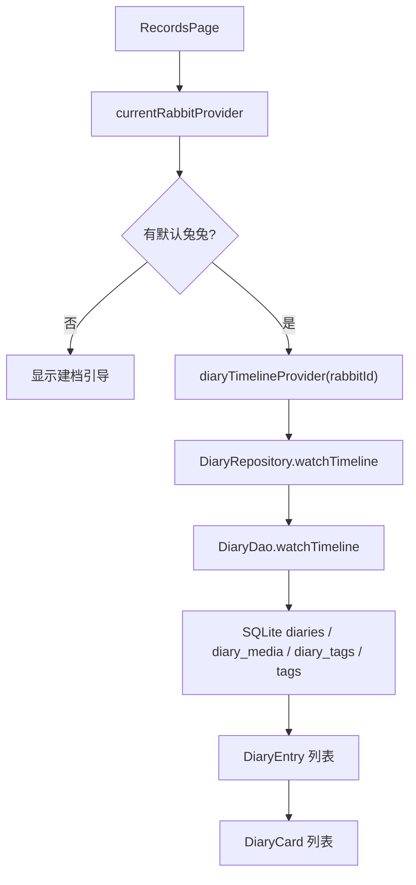
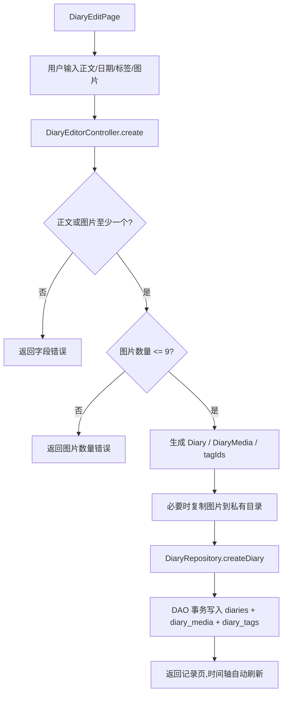
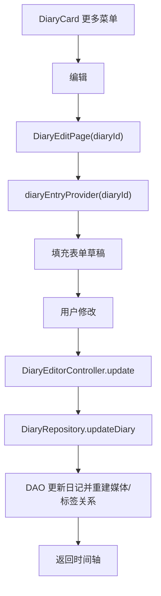
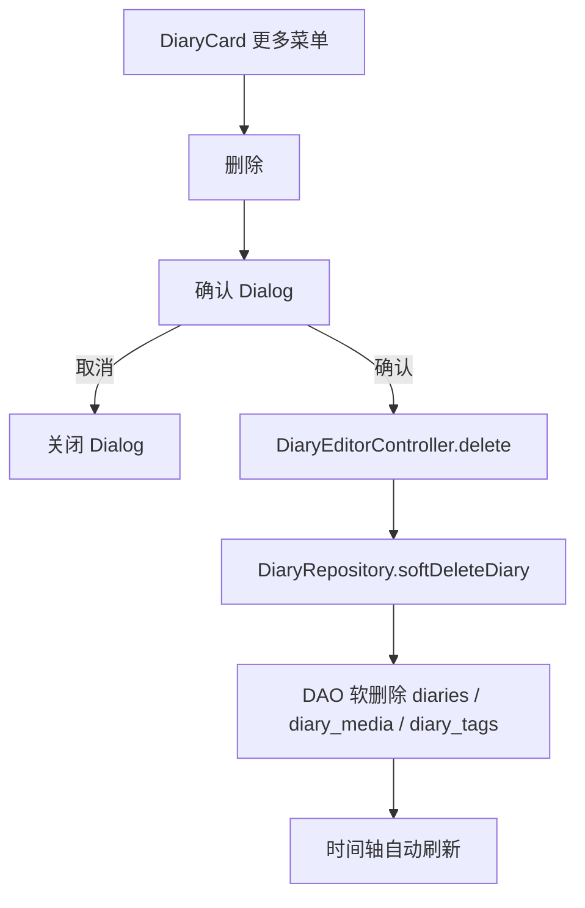

# Raby P4 日记与标签实施计划和架构设计

> 状态:初稿
>
> 日期:2026-06-09
>
> 适用阶段:P4 日记与标签
>
> 前置状态:P0/P1/P2/P3 已完成
>
> 关联文档:
> - [Raby MVP 实施计划](./2026-06-08-raby-mvp-implementation-plan.md)
> - [Raby v0.1 架构设计](./2026-06-09-raby-v0.1-architecture-design.md)
> - [Raby v0.1 数据模型详细设计](./2026-06-08-raby-v0.1-data-model.md)
> - [Raby v0.1 关键交互流程设计](./2026-06-08-raby-v0.1-interaction-flows.md)
> - [Raby 视觉风格规范](./2026-06-08-raby-visual-style-guide.md)

---

## 1. P4 目标

P4 的目标是把 Raby 从“能建立兔兔档案”推进到“能记录日常生活”。

P4 完成后应形成第二个核心闭环:

```text
启动 App -> 进入记录页 -> 写一条日记 -> 选择标签 -> 保存 -> 时间轴展示真实日记 -> 编辑/删除日记
```

P4 完整范围还包括图片能力:

```text
选择图片 -> 保存到 App 私有目录 -> 数据库存相对路径 -> 时间轴显示缩略图 -> 打开图片浏览
```

为了控制风险,P4 分两刀交付:

- P4-A:纯文字日记 + 系统标签 + 时间轴真实列表 + 编辑删除。
- P4-B:图片选择、媒体存储、缩略图/图片网格、图片浏览。

P4-A 是进入开发的第一刀,必须先完成。P4-B 在 P4-A 验收通过后接入。

---

## 2. 当前基线

### 2.1 已有能力

- App 启动初始化已完成:`/startup`。
- 首次建档、默认兔兔读取、档案详情和编辑已完成。
- 数据层已有:
  - `DiaryRepository`
  - `TagRepository`
  - `MediaStorageService`
  - `diaries`
  - `diary_media`
  - `tags`
  - `diary_tags`
- 系统标签已在启动阶段 seed。
- Repository 测试已覆盖:
  - 时间轴排序。
  - 媒体排序。
  - 标签聚合。
  - 日记软删除。

### 2.2 当前缺口

- 记录页仍有静态最近记录卡片,没有读取真实 `DiaryEntry`。
- 没有日记编辑页路由。
- 没有日记提交 controller。
- 没有标签选择 UI。
- 没有自定义标签 UI。
- 图片选择插件尚未接入。
- 媒体文件复制服务已有基础能力,但未接 UI 流程和测试。

---

## 3. 范围定义

### 3.1 P4 必做

| 编号 | 能力 | 说明 |
|---|---|---|
| P4-1 | 日记时间轴 | 记录页读取当前兔兔的真实日记列表 |
| P4-2 | 日记新建 | 正文、日期、标签,保存到本地数据库 |
| P4-3 | 日记编辑 | 读取原记录,修改正文、日期、标签 |
| P4-4 | 日记删除 | 二次确认后软删除 |
| P4-5 | 标签选择 | 系统标签 + 当前兔兔自定义标签 |
| P4-6 | 自定义标签 | 在日记编辑时可新增当前兔兔标签 |
| P4-7 | 图片能力 | 最多 9 张,复制到私有目录,时间轴展示 |
| P4-8 | 图片浏览 | 从时间轴打开图片浏览页 |

### 3.2 P4 第一刀只做

第一刀目标是尽快打通可用记录闭环:

- 日记时间轴真实列表。
- 新建纯文字日记。
- 选择系统标签。
- 通过轻量弹窗新增当前兔兔自定义标签。
- 编辑日记正文、日期、标签。
- 删除日记。
- 空状态和错误状态。

第一刀暂不做:

- 真实图片选择。
- 图片浏览。
- 自定义标签列表管理、重命名、批量删除。
- 分页。
- 日记详情页。

### 3.3 P4 不做

- 短视频。
- 记录热力图。
- 兔生大事记独立页面。
- 标签云。
- 全文搜索。
- 多兔切换。
- 日记导入导出。

---

## 4. 架构原则

P4 继续遵守 v0.1 架构设计:

```text
features/records/presentation
  -> features/records/application
  -> domain/repositories
  -> data/repositories
  -> data/database
```

关键约束:

- 页面不直接 import Drift、DAO、数据库表、`app_database.g.dart`。
- 页面不直接拼媒体绝对路径。
- 日记创建、编辑、删除必须经过 `DiaryRepository`。
- 标签读取和新增必须经过 `TagRepository`。
- 图片复制由 application controller 调用 `MediaStorageService`。
- Domain 实体仍保持纯 Dart。
- 记录页卡片和编辑页样式必须沿用 Raby Warm MD3,不引入大面积新视觉风格。

---

## 5. 目录设计

P4 后推荐目录:

```text
lib/features/records/
├── application/
│   ├── diary_editor_controller.dart
│   ├── diary_timeline_providers.dart
│   ├── tag_picker_providers.dart
│   └── media_draft.dart
├── presentation/
│   ├── diary_edit_page.dart
│   ├── photo_viewer_page.dart
│   ├── records_page.dart
│   └── widgets/
│       ├── diary_card.dart
│       ├── diary_empty_state.dart
│       ├── diary_media_grid.dart
│       ├── diary_tag_chips.dart
│       ├── media_picker_grid.dart
│       └── tag_picker_section.dart
```

职责:

- `diary_timeline_providers.dart`:当前兔兔时间轴、空态依赖。
- `tag_picker_providers.dart`:可用标签、标签创建入口。
- `diary_editor_controller.dart`:新建、编辑、删除日记命令。
- `media_draft.dart`:保存前的媒体草稿模型,只用于 application/presentation。
- `diary_card.dart`:时间轴单条卡片。
- `diary_media_grid.dart`:1/2-4/5-9 张图片布局。
- `media_picker_grid.dart`:编辑页图片选择和移除区域。
- `tag_picker_section.dart`:标签 Chip 多选和新增标签入口。

---

## 6. 路由设计

当前已有一级路由:

```text
/records
/weight
/me
```

P4 新增:

| 路由 | 页面 | 说明 |
|---|---|---|
| `/records/new` | `DiaryEditPage` | 新建日记 |
| `/records/:id/edit` | `DiaryEditPage` | 编辑日记 |
| `/media/photos` | `PhotoViewerPage` | 图片浏览,通过 `extra` 传图片列表和初始 index |

推荐路由常量:

```dart
abstract final class AppRoutes {
  static const recordsNew = '/records/new';
  static const recordEditPattern = '/records/:id/edit';
  static String recordEdit(String diaryId) => '/records/$diaryId/edit';
  static const mediaPhotos = '/media/photos';
}
```

不建议使用 `/records/edit/:id?`,原因:

- `go_router` 对可选 path 参数不如显式路径清晰。
- `/records/new` 与 `/records/:id/edit` 更容易写测试和深链。
- 避免 `edit` 被误识别为日记 id。

路由返回规则:

- 新建保存成功:返回 `/records`。
- 编辑保存成功:返回 `/records`。
- 删除成功:返回 `/records`。
- 取消:返回来源页。
- 图片浏览返回:回到时间轴原位置,不修改数据。

---

## 7. Provider 和状态设计

### 7.1 查询 Provider

```dart
final diaryTimelineProvider =
    StreamProvider.family<List<DiaryEntry>, String>((ref, rabbitId) {
  return ref.watch(diaryRepositoryProvider).watchTimeline(rabbitId);
});
```

用途:

- 记录页拿当前兔兔 id 后读取时间轴。
- Drift 数据变化时自动刷新。

```dart
final diaryEntryProvider =
    FutureProvider.family<DiaryEntry?, String>((ref, diaryId) {
  return ref.watch(diaryRepositoryProvider).getDiaryEntry(diaryId);
});
```

用途:

- 编辑页加载原日记。

```dart
final availableTagsProvider =
    StreamProvider.family<List<Tag>, String>((ref, rabbitId) {
  return ref.watch(tagRepositoryProvider).watchAvailableTags(rabbitId);
});
```

用途:

- 编辑页标签选择。
- 标签新增后自动刷新。

### 7.2 命令 Controller

P4-A 可以使用轻量 controller:

```dart
final diaryEditorControllerProvider = Provider<DiaryEditorController>((ref) {
  return DiaryEditorController(ref);
});
```

原因:

- P3 已证明轻量 controller + 页面本地 loading 对简单表单更稳定。
- P4 的复杂状态主要在编辑页本地草稿,不必一开始引入重状态机。

P4-B 加入图片后,如果草稿状态复杂,再升级为 `Notifier`:

```text
DiaryDraftState
  content
  recordedAt
  selectedTagIds
  mediaDrafts
  isSaving
  error
```

### 7.3 当前兔兔依赖

记录页和编辑页必须先拿当前默认兔兔:

```text
currentRabbitProvider -> rabbit.id -> diaryTimelineProvider(rabbit.id)
```

无兔兔时:

- 记录页显示建档引导。
- 不允许进入新建日记。
- 如果用户通过深链进入 `/records/new`,页面应显示“请先建立兔兔档案”并提供返回或建档入口。

---

## 8. 数据流

### 8.1 时间轴读取



### 8.2 新建日记



### 8.3 编辑日记



### 8.4 删除日记



---

## 9. 页面和组件设计

### 9.1 记录页

状态:

| 状态 | UI |
|---|---|
| 无兔兔 | 建档引导卡片 |
| 有兔兔但无日记 | 空状态 + “写第一条日记”按钮 |
| 有日记 | 时间轴列表 |
| 加载中 | 轻量 skeleton 或进度提示 |
| 错误 | 错误卡片 + 重试 |

布局规则:

- 顶部保留当前兔兔 Hero 信息。
- 快捷操作卡片保留“写生活日记”。
- 静态最近记录卡片替换为真实时间轴。
- 时间轴使用 `ListView` / `SliverList`,为 50 条以上记录预留可扩展结构。
- 底部内容保留导航栏安全距离。

### 9.2 日记卡片

日记卡片展示:

- 日期。
- 标签 Chip。
- 正文,最多 3 行。
- 图片网格。
- 更多菜单:编辑、删除。

交互:

- 点击图片进入图片浏览。
- 点击更多打开菜单。
- 删除使用危险色,并二次确认。
- 卡片本身不做复杂跳转,避免误触。

视觉:

- 使用 `RabyCard`。
- 正文优先,标签和图片作为辅助。
- 里程碑标签使用 `secondary` 风格。
- 不使用 emoji 作为结构性图标。

### 9.3 日记编辑页

页面结构:

```text
AppBar: 取消 / 标题 / 保存
正文输入
图片选择区
日期选择
标签选择
```

表单规则:

- 正文和图片至少一个。
- 正文为空且无图片时,保存按钮 disabled。
- 图片最多 9 张。
- 标签可为空。
- 保存时按钮 loading 并禁用重复点击。
- 保存失败保留用户输入。

日期规则:

- 默认当前时间。
- 可使用系统日期选择器。
- v0.1 不强制时间选择器,默认当天 12:00 或当前时间均可,但入库是 UTC epoch milliseconds。

### 9.4 标签选择

UI:

- 使用 Wrap + FilterChip。
- 系统标签和自定义标签在同一个区域展示。
- 里程碑标签视觉上使用 `secondary` token。
- 新增标签入口使用小型按钮或底部弹窗。

规则:

- 标签可多选。
- 已选状态必须通过背景、边框、文字/图标共同表达,不能只靠颜色。
- 自定义标签名 1-12 个字符。
- 同一只兔子的自定义标签名不能重复。

### 9.5 图片选择和媒体网格

P4-B 实现。

编辑页:

- 图片选择区固定尺寸,避免布局跳动。
- 添加按钮触控区不小于 48dp。
- 每张图片有移除按钮。
- 图片数量达到 9 后隐藏或禁用添加按钮。

时间轴:

- 1 张:大图。
- 2-4 张:2 列网格。
- 5-9 张:3 列网格。
- 缩略图使用固定 aspect ratio。
- 图片缺失时显示“照片文件不存在”的占位。

图片浏览:

- 全屏黑/深色背景。
- 顶部返回按钮。
- 支持左右切换。
- 如果暂不引入缩放库,先用 `InteractiveViewer` 支持基础缩放。

---

## 10. 媒体插件策略

P4-B 需要先做插件 spike。

候选:

| 方案 | 优点 | 风险 |
|---|---|---|
| `image_picker` | Flutter 常用,接入简单 | P1 阶段曾因 Android/Kotlin 构建链顾虑暂缓 |
| `file_selector` | 插件相对轻,可选择文件 | 移动端相册体验弱 |
| 仅保留媒体占位 | 无构建风险 | 不满足 v0.1 照片验收 |

建议:

1. P4-A 不引入图片插件。
2. P4-B 第一任务单独接入 `image_picker` 并立即跑:
   - `flutter pub get`
   - `flutter analyze`
   - `flutter test`
   - Android debug APK build
3. 如果 `image_picker` 构建失败,再评估 `file_selector` 或其他轻量方案。
4. 任何插件接入失败不能阻塞 P4-A 的文字日记闭环。

---

## 11. Application 层设计

### 11.1 `DiaryEditorInput`

P4-A:

```dart
class DiaryEditorInput {
  const DiaryEditorInput({
    required this.rabbitId,
    required this.content,
    required this.recordedAt,
    required this.tagIds,
  });

  final String rabbitId;
  final String content;
  final DateTime recordedAt;
  final List<String> tagIds;
}
```

P4-B 扩展:

```dart
final List<DiaryMediaDraft> mediaDrafts;
```

### 11.2 `DiaryMediaDraft`

```dart
sealed class DiaryMediaDraft {}

class ExistingDiaryMediaDraft extends DiaryMediaDraft {
  final DiaryMedia media;
}

class LocalDiaryMediaDraft extends DiaryMediaDraft {
  final String localPath;
  final String? mimeType;
  final int sortOrder;
}
```

用途:

- 编辑页区分已有媒体和新选图片。
- 保存时只复制新图片。
- 删除已有图片时通过 Repository 更新媒体集合。

### 11.3 `DiaryEditorController`

方法:

```text
create(input)
update(diaryId, input)
delete(diaryId)
createCustomTag(rabbitId, name)
```

职责:

- 生成 UUID。
- 读取 clock。
- 去重 tagIds。
- 校验正文/媒体至少一个。
- P4-B 复制图片。
- 调用 Repository。
- 捕获并上抛业务异常,由页面展示。

不负责:

- 直接写 Drift。
- 页面跳转。
- SnackBar。
- 复杂图片解码。

---

## 12. Repository 和 DAO 注意点

现有 `DiaryRepository.updateDiary` 通过软删除旧媒体和旧标签关系,再插入新集合。

P4-A 只更新标签和正文,风险较低。

P4-B 需要特别注意:

- 如果编辑时保留已有媒体并复用原 `media.id`,当前 DAO 可能插入同 ID 导致主键冲突。
- P4-B 实现前应修正 update 逻辑:
  - 方案 A:编辑保存时为最终媒体集合生成新的 `DiaryMedia.id`,旧媒体关系软删除。
  - 方案 B:DAO 对已有媒体做 update/upsert,对删除媒体软删除,对新增媒体 insert。
- v0.1 先采用方案 A,实现简单且可避开主键冲突;后续如果要做媒体元数据保留、导入合并或图片重排,再演进到方案 B。

P4-A 不应触碰媒体更新复杂逻辑。

---

## 13. 开发顺序

### P4-A:纯文字日记和标签闭环

| 顺序 | 任务 | 文件/产出 | 验收 |
|---:|---|---|---|
| 1 | 路由扩展 | `AppRoutes.recordsNew`, `AppRoutes.recordEditPattern`, `AppRoutes.recordEdit(id)` | 可进入新建/编辑页 |
| 2 | Timeline Provider | `diary_timeline_providers.dart` | 有兔兔时 watch 日记列表 |
| 3 | 标签 Provider | `tag_picker_providers.dart` | 编辑页显示系统标签 |
| 4 | 编辑 Controller | `diary_editor_controller.dart` | 可创建纯文字日记 |
| 5 | 自定义标签轻入口 | `tag_picker_section.dart` + controller 方法 | 可新增当前兔兔标签并立即选中 |
| 6 | 日记编辑页 | `diary_edit_page.dart` | 正文/日期/标签/保存 |
| 7 | 时间轴卡片 | `diary_card.dart` | 真实列表显示日记 |
| 8 | 空状态替换 | `diary_empty_state.dart` | 无日记时引导写第一条 |
| 9 | 编辑入口 | 卡片更多菜单 | 可编辑后更新时间轴 |
| 10 | 删除入口 | 确认 Dialog | 删除后时间轴消失 |
| 11 | 测试 | controller + widget | `flutter test` 通过 |

### P4-B:图片和媒体能力

| 顺序 | 任务 | 文件/产出 | 验收 |
|---:|---|---|---|
| 1 | 图片插件 spike | `pubspec.yaml` | Android debug build 通过 |
| 2 | 媒体草稿模型 | `media_draft.dart` | 可表示已有/新增媒体 |
| 3 | 图片选择 UI | `media_picker_grid.dart` | 最多 9 张,可移除 |
| 4 | 媒体复制流程 | controller + `MediaStorageService` | 入库相对路径 |
| 5 | 时间轴图片网格 | `diary_media_grid.dart` | 1/2-4/5-9 布局稳定 |
| 6 | 图片浏览页 | `photo_viewer_page.dart` | 可打开、返回 |
| 7 | 媒体测试 | storage + widget | 图片路径和 UI 状态通过 |

---

## 14. 验收标准

### 14.1 P4-A 验收

- 有默认兔兔时记录页显示真实时间轴。
- 没有日记时显示空状态和“写第一条日记”入口。
- 点击“写生活日记”进入新建页。
- 输入正文、选择日期、选择标签后可保存。
- 可新增当前兔兔自定义标签,新增后立即可选中并随日记保存。
- 保存后返回记录页,新日记出现在时间轴顶部。
- 日记标签展示正确。
- 编辑日记后正文、日期、标签更新。
- 修改日期后时间轴排序更新。
- 删除日记需二次确认。
- 删除后时间轴不再显示。
- 退出 App 重新进入后日记仍在。

### 14.2 P4-B 验收

- 可选择 1-9 张图片。
- 超过 9 张时阻止或明确提示。
- 保存后图片复制到 App 私有目录。
- 数据库只保存相对路径。
- 时间轴按规范显示图片网格。
- 点击图片进入浏览页。
- 图片缺失或解码失败时不崩溃。
- 删除日记后时间轴不再引用该日记图片。

### 14.3 架构验收

- `features/records/presentation` 不 import `data/database`、Drift、DAO。
- P4 页面通过 application provider/controller 调 Repository。
- Controller 不负责路由跳转。
- 图片复制失败不会写入数据库。
- 数据库写入失败时,P4-B 会尝试清理新复制图片。
- `flutter analyze` 无问题。
- `flutter test` 通过。
- Android debug APK build 通过。

---

## 15. 测试计划

### 15.1 Controller 测试

使用 fake Repository:

- 创建纯文字日记成功。
- 正文为空且无媒体时报错。
- tagIds 去重。
- 编辑日记成功。
- 删除日记成功。
- 创建自定义标签成功。
- 重复自定义标签时显示业务错误。

### 15.2 Widget 测试

使用 fake Repository:

- 无日记空状态。
- 有日记时间轴展示。
- 新建日记后回到记录页。
- 编辑日记后 UI 更新。
- 删除确认取消不删除。
- 删除确认后日记消失。
- 标签多选状态可见。

### 15.3 Data/Repository 测试

P2 已覆盖基础行为。P4 可补:

- 更新日记不因重复媒体 id 产生主键冲突。
- 删除标签后历史日记不会崩溃。
- 自定义标签软删除后不出现在可用标签。

### 15.4 媒体测试

P4-B 增加:

- `MediaStorageService.diaryMediaRelativePath` 路径稳定。
- 保存路径为相对路径。
- 复制失败时 controller 不调用 Repository。
- 复制成功但 Repository 失败时尝试清理。

---

## 16. 风险和处理

| 风险 | 影响 | 处理 |
|---|---|---|
| 图片插件构建失败 | P4-B 受阻 | P4-A 先交付,图片插件单独 spike |
| 编辑日记媒体更新主键冲突 | 图片编辑失败 | P4-B 前修正 DAO update 策略 |
| 时间轴图片多导致卡顿 | 滚动体验差 | 固定尺寸、懒加载、后续分页 |
| 标签 UI 太复杂 | 编辑页负担大 | P4-A 先系统标签多选,自定义标签用轻量弹窗 |
| 表单状态过重 | 代码复杂 | P4-A 轻量 controller,图片接入后再升级状态模型 |
| 记录页视觉回退到普通列表 | 风格不统一 | 复用 RabyCard、Chip、图片网格和 Warm MD3 token |

---

## 17. Done 标准

P4-A Done:

- 纯文字日记 + 标签闭环可用。
- 时间轴真实数据展示。
- 新建、编辑、删除都可落库并刷新。
- 测试覆盖 controller 和 widget。
- `flutter analyze`、`flutter test`、Android debug build 通过。

P4-B Done:

- 图片选择、保存、显示、浏览可用。
- 媒体路径为相对路径。
- 图片失败状态不崩溃。
- 媒体相关测试通过。
- Android debug build 通过。

P4 完整 Done:

- v0.1 验收脚本中“写日记、看时间轴、编辑、删除、图片浏览”全部通过。

---

## 18. 文档自评审

### 18.1 结论

本文档可以作为 P4 开发入口。范围、架构边界、开发顺序和验收标准已经覆盖 P4-A 与 P4-B。

### 18.2 评审发现

首次评审发现 P4-A 开发顺序遗漏“自定义标签轻入口”,已补入开发顺序和第一刀范围。

第二轮评审发现 P4-A 验收标准未显式覆盖自定义标签保存,已补入验收标准。

当前无阻塞问题。

### 18.3 需在实现时重点复查

- P4-B 前必须复查 `DiaryRepository.updateDiary` 和 DAO 的媒体更新策略,避免复用已有媒体 id 时插入冲突。
- 图片插件必须独立 spike,不能在大批 UI 改动后才发现 Android 构建失败。
- Widget 测试应继续使用 fake Repository;真实 Drift 行为放在 data/repository 测试里。
- P4-A 不应提前引入图片复杂状态,否则第一刀会被插件和媒体补偿逻辑拖慢。

---

## 19. 实施记录

### 19.1 P4-A

状态:已完成。

完成内容:

- 纯文字日记创建、编辑、删除。
- 系统标签选择。
- 自定义标签新增并立即选中。
- 记录页真实时间轴。
- 日记页返回按钮和系统返回修复。
- 日期选择器中文本地化。

验收结果:

- `flutter analyze`:通过。
- `flutter test`:16 个测试通过。
- Android arm64 release APK:通过。

### 19.2 P4-B-1 图片插件 Spike

状态:已完成。

完成内容:

- 接入 `image_picker`。
- 验证插件依赖不会破坏现有启动、建档、日记闭环。
- 验证 Android arm64 release 构建可通过。

验收结果:

- `flutter analyze`:通过。
- `flutter test`:16 个测试通过。
- `flutter build apk --release --target-platform android-arm64`:通过。

### 19.3 P4-B-2 至 P4-B-5 图片选择、保存和时间轴展示

状态:已完成。

完成内容:

- 新增媒体草稿模型 `DiaryMediaDraft`,区分已有媒体和本地新选图片。
- 新增 `MediaPickerService`,通过 `image_picker` 选择多张图片并限制最多 9 张。
- 日记编辑页加入照片选择网格,支持添加、计数和移除。
- `DiaryEditorController` 支持照片-only 日记、图片复制到 App 私有目录、生成 `DiaryMedia` 并写入数据库。
- 编辑已有带图日记时保留已有图片相对路径,保存时重建最终媒体集合以避免 DAO 主键冲突。
- 时间轴日记卡片支持图片网格展示,1 张大图、2-4 张双列、5-9 张三列。
- 新增 controller 测试覆盖照片-only 日记和本地图片复制入库。

验收结果:

- `flutter analyze`:通过。
- `flutter test`:17 个测试通过。
- `flutter build apk --release --target-platform android-arm64`:通过。
- Android arm64 release APK: [raby-p4b-media-arm64-release-20260609.apk](http://103.8.33.7:8800/files/znxj/raby-p4b-media-arm64-release-20260609.apk)。

后续状态:

- 数据库写入失败后的新复制图片清理补偿已在 19.5 完成。

### 19.4 P4-B-6 图片全屏浏览页

状态:已完成。

完成内容:

- 实现图片浏览页 `PhotoViewerPage`。
- 新增 `/media/photos` 路由,通过 `PhotoViewerArgs` 传入图片列表和初始下标。
- 时间轴图片网格支持点击查看,并为每张图提供可访问的 tooltip。
- 浏览页支持左右切换、页码展示、返回记录页、基础缩放和图片读取失败占位。
- 新增 widget 测试覆盖“时间轴点击图片 -> 进入浏览页 -> 返回记录页”。

验收结果:

- `flutter analyze`:通过。
- `flutter test`:18 个测试通过。
- `flutter build apk --release --target-platform android-arm64`:通过。
- Android arm64 release APK: [raby-p4b-photo-viewer-arm64-release-20260610.apk](http://103.8.33.7:8800/files/znxj/raby-p4b-photo-viewer-arm64-release-20260610.apk)。

### 19.5 P4-B-7 媒体保存补偿

状态:已完成。

完成内容:

- `MediaStorageService` 新增 `deleteRelativePath`,用于删除 App 私有目录中的相对路径文件。
- `DiaryEditorController` 在创建/编辑日记时记录本次新复制成功的图片路径。
- 如果媒体复制流程中途失败,或 Repository 写数据库失败,会清理本次已经复制成功的新图片。
- 清理失败不会覆盖原始保存错误,页面仍能展示原始失败原因。
- 已有媒体草稿不会被补偿逻辑删除,避免编辑失败时误删历史图片文件。
- 新增 controller 测试覆盖“复制成功但入库失败会清理本次新图片”。

验收结果:

- `flutter analyze`:通过。
- `flutter test`:19 个测试通过。
- 本次按当前要求未执行 APK 打包和公网上传。

### 19.6 P4 完成状态

状态:代码层面 Done,待真机验收。

已完成闭环:

- 写文字日记。
- 选择系统标签和新增自定义标签。
- 新建、编辑、删除日记。
- 时间轴展示真实数据。
- 选择 1-9 张图片并保存到 App 私有目录。
- 图片-only 日记。
- 时间轴图片网格。
- 图片全屏浏览、左右切换、缩放和返回。
- 保存失败时清理本次新复制图片。

进入下一阶段前建议真机验收:

- 选 1/3/9 张图保存。
- 重启 App 后确认图片仍可查看。
- 编辑日记移除图片。
- 删除日记后确认时间轴不再引用。
- 图片浏览页验证返回、左右滑和双指缩放。
