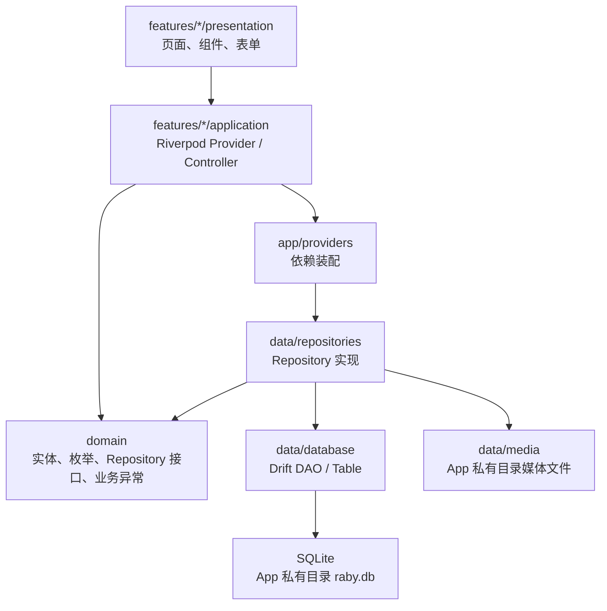

# Raby v0.1 架构设计

> 状态:初稿
>
> 日期:2026-06-09
>
> 适用版本:v0.1 可记录内测版
>
> 关联文档:
> - [Raby MVP 实施计划](./2026-06-08-raby-mvp-implementation-plan.md)
> - [Raby v0.1 数据模型详细设计](./2026-06-08-raby-v0.1-data-model.md)
> - [Raby 移动端 UI/UX 设计规格](./2026-06-08-raby-ui-ux-spec.md)
> - [Raby 视觉风格规范](./2026-06-08-raby-visual-style-guide.md)

---

## 1. 目标

这份文档用于约束 P3 之后的功能实现,确保代码在继续接入真实数据、表单、图片和图表时保持清晰。

v0.1 架构目标:

- UI 不直接依赖 Drift、SQLite row、数据库表。
- 业务对象和业务规则尽量集中,不散落在页面事件里。
- 本地存储实现可以替换或扩展,为 v0.2/v1.0 的导入导出、多兔和同步预留空间。
- 页面状态、异步操作、错误处理有统一方式。
- 每个阶段能通过 `flutter analyze`、`flutter test` 和 Android debug build 验收。

v0.1 不追求:

- 过重的企业级分层模板。
- 为所有简单读取都创建独立 UseCase 类。
- 在需求尚未稳定前引入复杂状态机。

---

## 2. 总体架构



推荐依赖方向:

```text
app -> features -> domain
app -> data -> domain
features/application -> domain
features/presentation -> features/application + shared + app/router
data -> domain
shared -> app/theme
```

禁止依赖方向:

```text
domain -> flutter / riverpod / drift / app / features / data
features/presentation -> drift / app_database.g.dart / tables
features/presentation -> data/database
data -> features
shared -> features
```

说明:

- `domain` 是纯 Dart 业务层,只表达 Raby 的业务对象和能力。
- `data` 是本地存储和媒体文件实现,负责把 Drift row 映射成 Domain 实体。
- `features` 是用户可见功能,包含页面、表单、局部状态和提交动作。
- `app` 是应用装配层,放路由、主题、全局 provider。
- `shared` 只放跨页面复用 UI,不能包含业务流程。

---

## 3. 当前代码基线

当前项目已形成以下结构:

```text
lib/
├── app/
│   ├── router/
│   └── theme/
├── data/
│   ├── database/
│   ├── media/
│   ├── providers/
│   └── repositories/
├── domain/
│   ├── models/
│   └── repositories/
├── features/
│   ├── profile/
│   ├── records/
│   └── weight/
└── shared/
    ├── navigation/
    └── widgets/
```

P2 已完成:

- `AppDatabase`、Drift 表、索引和 DAO。
- `Rabbit`、`Diary`、`DiaryMedia`、`Tag`、`WeightRecord` 等 Domain 实体。
- `RabbitRepository`、`DiaryRepository`、`TagRepository`、`WeightRepository` 接口。
- Drift Repository 实现和 mapper。
- Repository 与数据库行为测试。

P3 前建议调整:

- 将 `lib/data/providers/data_providers.dart` 迁移或复制为 `lib/app/providers/repository_providers.dart`。
- 页面和 feature controller 只从 `app/providers` 获取 Repository,不要直接引入 `data` 层。
- 迁移后 `data/providers` 可删除或保留为内部临时文件,但不应被 UI 使用。

---

## 4. 分层职责

### 4.1 `domain`

职责:

- 定义业务实体、枚举和值。
- 定义 Repository 接口。
- 定义业务异常,例如 `DomainValidationException`。
- 放与存储无关的纯业务规则。

约束:

- 不 import Flutter、Riverpod、Drift、SQLite、path_provider。
- 不关心页面、路由、SnackBar、Form。
- 不出现数据库 row、Companion、Table。

当前可接受设计:

- v0.1 先使用普通不可变 class。
- 暂不强制引入 `freezed`,避免新增生成复杂度。
- 如果后续表单编辑和拷贝逻辑明显变多,再引入 `copyWith` 或 `freezed`。

### 4.2 `data`

职责:

- Drift 表、DAO、数据库连接和迁移。
- Repository 接口的本地实现。
- Domain 和 Drift row 的双向映射。
- 媒体文件复制、相对路径生成、私有目录解析。

约束:

- 可以依赖 `domain`。
- 不能依赖任何 `features`。
- Drift row 不能穿透到 `domain` 或 `features/presentation`。
- 数据库只保存媒体相对路径,不保存绝对路径。

### 4.3 `features/*/application`

职责:

- Riverpod `Provider`、`StreamProvider`、`AsyncNotifier`、表单提交 controller。
- 组织 Repository 调用。
- 生成 UUID 和时间戳。
- 把页面输入转换成 Domain 实体。
- 把业务异常转换为 UI 可理解的状态。

约束:

- 不能 import Drift 表、DAO、Companion。
- 简单读取优先使用 `StreamProvider` / `FutureProvider`。
- 新增、编辑、删除等命令优先使用 `AsyncNotifier` 或小型 controller。
- 页面导航不放进 Repository;保存成功后由页面或 controller 状态通知页面跳转。

### 4.4 `features/*/presentation`

职责:

- 页面布局、表单、列表、交互反馈。
- 调用 application provider。
- 展示 loading、empty、error 和 success。

约束:

- 不直接创建 Domain 实体的复杂对象图;复杂创建交给 application controller。
- 不直接操作数据库。
- 不直接处理媒体文件复制。
- 不把业务校验散落在 `onPressed` 里;字段级校验可以放表单,跨字段校验交给 controller 或 Repository。

### 4.5 `app`

职责:

- `MaterialApp.router`。
- go_router 路由表。
- Theme 和全局样式。
- Repository、数据库、媒体服务、UUID、Clock 等依赖装配。
- App 启动初始化流程。

约束:

- 路由常量集中在 `AppRoutes`。
- ShellRoute 只承载一级 Tab 页面。
- 首次建档、编辑页、详情页等二级页面通过路由进入,不要塞进底部导航。

### 4.6 `shared`

职责:

- 跨 feature 复用的纯 UI 组件。
- 不包含业务语义的通用展示组件。

约束:

- 可以使用主题 token。
- 不依赖 Repository。
- 不访问数据库。
- 不包含页面级流程。

---

## 5. Feature 目录模板

P3 之后建议每个功能按以下结构扩展:

```text
lib/features/rabbits/
├── application/
│   ├── current_rabbit_providers.dart
│   └── rabbit_form_controller.dart
├── presentation/
│   ├── rabbit_onboarding_page.dart
│   ├── rabbit_detail_page.dart
│   ├── rabbit_edit_page.dart
│   └── widgets/
│       └── rabbit_form.dart
```

```text
lib/features/records/
├── application/
│   ├── diary_timeline_providers.dart
│   └── diary_editor_controller.dart
├── presentation/
│   ├── records_page.dart
│   ├── diary_edit_page.dart
│   └── widgets/
```

```text
lib/features/weight/
├── application/
│   ├── weight_record_providers.dart
│   └── weight_editor_controller.dart
├── presentation/
│   ├── weight_page.dart
│   ├── weight_edit_page.dart
│   └── widgets/
```

规则:

- `presentation/widgets` 只放当前 feature 内部组件。
- 被两个以上 feature 使用的 UI 才移动到 `shared/widgets`。
- 不提前抽象。先让重复出现两次以上,再判断是否抽 shared。

---

## 6. 状态管理策略

### 6.1 查询类状态

使用 `StreamProvider`:

- 当前默认兔子。
- 日记时间轴。
- 体重记录列表。
- 体重图表数据。

使用 `FutureProvider`:

- 一次性详情查询。
- 页面进入时加载编辑数据。

示例设计:

```dart
final currentRabbitProvider = StreamProvider<Rabbit?>((ref) {
  return ref.watch(rabbitRepositoryProvider).watchDefaultRabbit();
});
```

### 6.2 命令类状态

使用 `AsyncNotifier` 或 `StateNotifier`:

- 创建兔兔档案。
- 编辑兔兔档案。
- 新增/编辑/删除日记。
- 新增/编辑/删除体重。
- 图片复制和媒体入库。

命令 controller 只表达一次用户动作的过程:

```text
idle -> loading -> success
idle -> loading -> error
```

页面基于状态:

- loading 时禁用按钮。
- error 时显示字段错误或 SnackBar。
- success 时返回或跳转。

### 6.3 表单状态

v0.1 简单表单可以使用 Flutter `Form` + 局部 `StatefulWidget`。

适用:

- 兔子档案表单。
- 体重表单。
- 简单日记正文输入。

当表单需要跨组件共享、动态图片列表、标签选择、保存草稿时,再升级为 feature controller 管理。

---

## 7. 路由设计

v0.1 路由建议:

| 路由 | 页面 | Shell |
|---|---|---|
| `/startup` | 启动初始化页 | 否 |
| `/onboarding/rabbit` | 首次建档页 | 否 |
| `/records` | 记录首页 | 是 |
| `/records/edit` | 新建日记 | 否或浮层 |
| `/records/edit/:id` | 编辑日记 | 否或浮层 |
| `/weight` | 体重首页 | 是 |
| `/weight/edit` | 新增体重 | 否或浮层 |
| `/weight/edit/:id` | 编辑体重 | 否或浮层 |
| `/me` | 我的页 | 是 |
| `/me/rabbit` | 档案详情 | 否或 Shell 子页 |
| `/me/rabbit/edit` | 档案编辑 | 否或 Shell 子页 |
| `/settings` | 设置 | 否或 Shell 子页 |

启动策略:

1. App 进入 `/startup`。
2. `StartupController` 执行系统标签 seed。
3. 查询默认兔子。
4. 无兔子跳转 `/onboarding/rabbit`。
5. 有兔子跳转 `/records`。

说明:

- 不建议在首版直接把复杂 async redirect 写进 router,避免初始化时机不清晰。
- `/startup` 可以是很轻的页面,只负责初始化和跳转。

---

## 8. 创建/编辑流程边界

### 8.1 创建兔兔

推荐流程:

```text
RabbitOnboardingPage
  -> RabbitForm
  -> RabbitFormController.submit(input)
  -> 生成 id / createdAt / updatedAt
  -> RabbitRepository.createRabbit(rabbit)
  -> TagRepository.ensureSystemTagsSeeded()
  -> success
  -> 页面跳转 /records
```

表单负责:

- 字段输入。
- 基础字段级校验,例如必填、长度。

Controller 负责:

- 组装 `Rabbit`。
- 处理跨字段规则,例如生日和领养日至少一个。
- 捕获 `DomainValidationException`。

Repository 负责:

- 最终业务校验。
- 写数据库。

### 8.2 创建日记

推荐流程:

```text
DiaryEditPage
  -> DiaryEditorController.submit(input)
  -> 复制图片到 App 私有目录
  -> 生成 Diary / DiaryMedia / tagIds
  -> DiaryRepository.createDiary(...)
  -> success
  -> 返回 /records
```

事务边界:

- 图片复制不属于 SQLite 事务。
- 数据库提交失败时,controller 需要尝试删除刚复制的临时图片。
- 数据库事务仍由 DAO 负责,插入 `diaries`、`diary_media`、`diary_tags` 必须同成同败。

### 8.3 创建体重

推荐流程:

```text
WeightEditPage
  -> WeightEditorController.submit(input)
  -> 生成 WeightRecord
  -> WeightRepository.createRecord(record)
  -> success
  -> 返回 /weight
```

规则:

- 输入单位固定为 g。
- UI 可显示 kg 换算,但入库统一为 g。
- 少于 4 条数据时,体重页优先展示列表和摘要。

---

## 9. 错误处理

错误分三类:

| 类型 | 来源 | UI 处理 |
|---|---|---|
| 字段错误 | 表单校验 | 字段下方错误文案 |
| 业务错误 | `DomainValidationException` | 字段错误或页面级提示 |
| 存储错误 | Drift、文件系统 | SnackBar/错误页,保留重试入口 |

规则:

- Repository 可以抛 `DomainValidationException`。
- Data 层底层异常不直接暴露给普通用户文案。
- Controller 负责把异常转成页面可展示状态。
- 删除动作必须二次确认。
- 保存按钮 loading 时禁用重复提交。

---

## 10. 数据和时间规则

- 所有业务主键使用 UUID v4。
- `createdAt`、`updatedAt`、`deletedAt` 使用 UTC 时间。
- 日期型字段如生日、领养日继续使用 `yyyy-MM-dd` 字符串。
- 所有删除默认为软删除。
- 查询 UI 数据时默认过滤 `deletedAt != null` 的记录。
- Repository 写操作必须更新 `updatedAt`。

建议新增两个 app 级 provider:

```text
clockProvider: DateTime.now().toUtc()
uuidProvider: Uuid()
```

好处:

- 测试里可以固定时间和 ID。
- 表单 controller 不直接依赖系统时间。

---

## 11. 测试策略

### 11.1 已有测试

当前已有:

- 数据库索引测试。
- 默认兔子和软删除测试。
- 系统标签 seed 测试。
- 日记时间线、媒体排序、标签聚合测试。
- 体重列表和图表排序测试。
- 基础 Widget smoke test。

### 11.2 P3 后新增测试

P3 兔兔档案:

- 无兔子时启动进入建档。
- 建档表单必填校验。
- 生日和领养日至少一个。
- 创建成功后首页显示兔子名。
- 退出重进后仍能读到默认兔子。

P4 日记:

- 正文和照片至少一个。
- 超过 9 张照片失败。
- 时间轴空状态和有数据状态。
- 删除日记后 UI 不显示。

P5 体重:

- 体重必须大于 0。
- 创建后列表倒序展示。
- 图表数据升序。
- 删除后列表和图表同步。

测试分层:

```text
domain/data repository tests -> 验证业务和存储
feature controller tests -> 验证提交流程和错误状态
widget tests -> 验证页面空态、表单校验、导航
```

---

## 12. 代码质量规则

每次功能完成必须满足:

- `dart format lib test`
- `dart run build_runner build`
- `flutter analyze`
- `flutter test`
- 涉及 Android 构建时运行 debug APK build

代码规则:

- 手写代码不修改 `*.g.dart`。
- 不在页面里写 SQL 或 Drift 查询。
- 不在页面里直接拼媒体绝对路径。
- 不把复杂业务逻辑塞进 `build()`。
- `build()` 中不做异步副作用。
- Provider 命名表达数据语义,例如 `currentRabbitProvider`,不要用 `dataProvider1`。
- Widget 文件过长时优先拆私有 widget,不要提前抽全局组件。
- 只有被多个 feature 复用的组件才进入 `shared`。
- 删除、保存、图片复制等异步操作必须有 loading/disabled 状态。

---

## 13. P3 落地顺序

P3 建议拆成 5 个小任务:

| 顺序 | 任务 | 产出 | 验收 |
|---:|---|---|---|
| 1 | 依赖装配整理 | `app/providers/repository_providers.dart`、`clockProvider`、`uuidProvider` | UI 不直接 import `data/database` |
| 2 | 启动初始化 | `/startup`、系统标签 seed、默认兔查询 | 无兔子进入建档 |
| 3 | 兔兔建档 | `features/rabbits`、建档表单、controller | 创建后进入记录页 |
| 4 | 首页接默认兔 | 记录页读取 `currentRabbitProvider` | 首页显示真实兔兔信息 |
| 5 | 档案详情/编辑 | 我的页入口、详情页、编辑页 | 修改后重进仍保留 |

完成 P3 后,App 应达到:

```text
启动 App -> 无兔子进入建档 -> 创建兔子 -> 首页显示真实兔子 -> 退出重进仍显示
```

这是 v0.1 从静态原型进入可用产品的第一个闭环。

---

## 14. 架构验收清单

- [ ] `domain` 没有 Flutter/Riverpod/Drift import。
- [ ] 页面没有直接 import `app_database.dart`、`app_database.g.dart` 或 Drift 表。
- [ ] Repository 接口位于 `domain/repositories`。
- [ ] Repository 实现位于 `data/repositories`。
- [ ] 查询状态使用 `StreamProvider` 或 `FutureProvider`。
- [ ] 写操作使用 controller 管理 loading/error/success。
- [ ] 表单校验覆盖字段级和跨字段规则。
- [ ] 数据库写操作经过 Repository。
- [ ] 媒体文件只保存相对路径。
- [ ] 关键业务行为有测试。
- [ ] `flutter analyze` 和 `flutter test` 通过。
